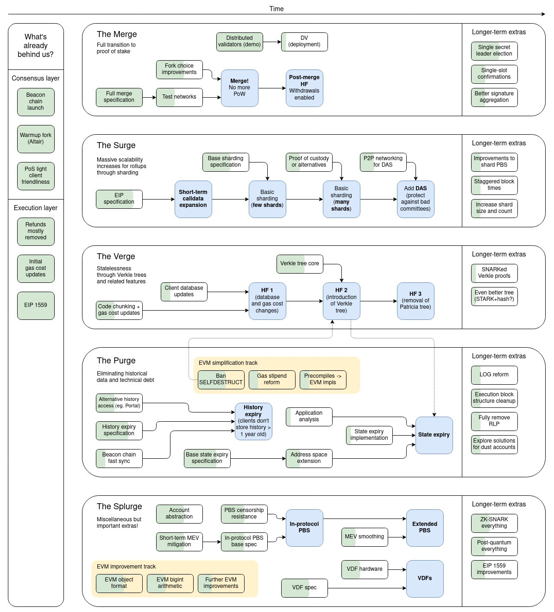

# Blockchain Development Guide

## About me

I'm DCBuilder and I'm currently a researcher at Moralis, a web3 development platform. I'm currently learning blockchain development and building demo projects. In this process I have come around many different resources and I wanted to create a guide for anyone that might be going through the same process by leveraging my research skills.

I've been coding since I was 14 and got really interested in technology in order to maximize the amount of positive impact I have on the world. After having tried web development, AI/ML, and a few others I eventually stumbled upon blockchain development. It was a completely new world to me, unlike other technologies which had pretty straightforward learning paths and specializations it felt that developing on top of blockchains was very hard to get into (this was in early 2018 all the way to 2020), so I decided to learn about how blockchains work in general and the types of applications that are built on top first before learning how to build them. Looking back that might not have been the best decision, but it led me to where I am now.

## Introduction

Nowadays there are countless well-made resources on how to learn blockchain development of all kinds and with different specializations in mind, however it is still very hard to get guidance and personalized suggestions based on your interests. I am writing this guide in order to provide an aggregator of all the resources that I've found over the years, plus give some opinionated commentary on how to approach them and how to use them in order to maximize learning and practical understanding in order to get building cool things in the space as soon as possible.

This guide will focus on the Ethereum ecosystem as that's where most developers and applications are. If you are interested in other ecosystems that are non-EVM compatible and are not L2s on Ethereum, then check out their respective documentations or guides written by their developer communities. Examples of other non-EVM compatible blockchains that are popular are Solana (Rust/Anchor), Polkadot (Rust/Substrate), Cosmos, Terra, and others. Most of these blockchains do or will support the EVM stack through various initiatives like Neon EVM (Solana), Moonbeam/Moonriver (Polkadot/Kusama), EVMOS (Cosmos), etc.

I really want this guide to become a community-sourced resource that everyone will be able to take advantage of. I will do my best to present it to the wider blockchain developer community to get constructive feedback, proofreading help, and insight into how to make it the best available guide available. 

### What is blockchain development?

There are two main categories in my mind, either you build the infrastructure that runs blockchain-based networks or you build applications that run on top of these decentralized and permissionless networks. Of course this differentiation doesn't encompass all types of development on blockchains, but it is a good way to get started. 

By blockchain infrastructure, people usually mean client implementations of blockchain protocols that nodes or validators run to keep the chains running. These clients are usually focused on distributed ledger technology, networking, virtual machines, and various other low-level types of engineering. The client is what enforces the rules of the blockchain protocol, runs the consensus mechanism, what executes all transactions in the network and makes sure all nodes are in sync, and more. This is also known as core blockchain development, which is not what most devs picture when thinking about blockchain or web3 development in general. There's various niches within blockchain development itself as well; you can focus on improving execution capabilities with technologies like rollups, validiums or volitions, you can improve decentralization and security guarantees by innovating on the consensus layer of the protocol, etc.

There's also blockchain infrastructure which supports the application layer by providing APIs to access blockchain data like oracles for smart contracts, indexing services for back ends, libraries that allow you to call and listen to smart contract events, decentralized storage services, and more.

The most popular type of blockchain development is on top of the application layer. Building decentralized applications (dapps) can take many different forms, but it usually involves a smart contract and a user interface which interacts with that smart contract and listens to changes in the state of the blockchain. These applications can serve various use cases and can be used to build decentralized financial services, games, and so much more.

There's also applications which aggregate data from different smart contracts, transactions and events on the blockchain to provide useful insight, these apps are mostly centered around data analysis and are not necessarily decentralized, but require an understanding of the underlying blockchain-based technologies.

If these concepts are completely foreign to you I suggest reading the how to get started section first, or Google the words you may not understand.

### Specializations

There's many different specializations within blockchain development, each require a different set of skills, however a general understanding of distributed systems, basic cryptography and knowing how smart contracts operate is required as a foundation for all of them. In this guide I'll try to provide a general overview of each of them as well as giving the best guidance I can provide on the resources learners should prioritize and in which order they should take them. There's many roles which I'm not as familiriazed with, so feel free to suggest pull requests with changes or DM with suggestions.

#### Skill-based

There are different sets of skills required for different specializations, the technology stack and knowledge needed are determined by the layer and application that you want to target as a developer. I believe that everyone should get a solid general foundation and try out different areas and niches before settling on a main one to focus on. Some people choose specializations according to the end goal that they want to accomplish using blockchain-based technologies, others like myself feel like everything is interesting and can't settle on a single one to specialize in when confronted with an analysis paralysis situation.

This guide will cover these main tracks, however anyone is free to submit a pull-request to add more or expand on the already existing ones:

- Core development
- Smart contract development
- Backend blockchain development
- Frontend development
- Full-stack blockchain development
- Security engineers
- MEV searcher
- Protocol development
- Cryptographer

#### Application-based

Another way to separate types of blockchain development is not based on the underlying tech stack, but on the use case that you are targeting. These are the categories that I believe are the most popular, however there's many others which I'm not covering to keep the scope of this article more manageable. 

- DeFi
- NFTs / Creator economy / Metaverse
- MEV
- L2s
- Infrastructure
- Gaming
- Privacy
- Coordination / Public goods

## How to get started?

No matter if you are a beginner programmer or if you've been coding for years, this guide will provide resources for all levels of expertise. If there is something that you already know in the specialization roadmaps that I have here, feel free to skip the material or use it as an opportunity to review what you already know and potentially fill in some gaps in your understanding.

Blockchain development might seem very intimidating at first, there are many moving parts, foundational knowledge from various different fields is required, the technologies are constantly evolving and aren't as mature as in other areas of development such as in the web development space, there is a financial aspect to almost every application as you are programming on top of a value layer, etc. However, it is not as hard as you might think. Once you get familiriazed with the basics, understanding everything else that is going on is usually just a matter of applying a general understanding to a specific situation. If you build a strong foundation then it will be much easier to process more complex topics and reason about problems relating to a new subject matter.

If you have a background in computer science, mathematics or any related field, then you will have a much easier time getting started with blockchain development as many foundational concepts are abstractions of algorithms and data structures. If you are a complete beginner then please make sure you take the initial few steps with patience so as to not feel overwhelmed. Once you start familiarizing yourself with the material you will start to feel like it is more manageable.

### General foundation

In order to get started with blockchain development on Ethereum, one must first get started with understanding how blockchains work in order to build a mental model of how each moving piece works and to get an understanding of the design principles which will govern your development experience.

#### Blockchains

The term blockchain has two different meanings, it can either relate to a data structure or to a computer network. 

A blockchain (data structure) consists of sets of transactions or data bundled inside a container where each container has a cryptographic [hash](https://www.youtube.com/watch?v=QJ010l-pBpE) of the data in the previous container (block) within it. If the contents of the previous block change, the hash changes as well and thanks to this feature we can assure that the data hasn't been tampered with. The second consequence of the blockchain data structure is that it is append-only. You can't prepend data to it, nor modify the data already within it, as that would alter the hashes of all the blocks succeeding the ones that have been modified. This is why we call blockchains immutable.


A blockchain (network) is a network of computers which have a synchronized ledger of transations which uses the blockchain (data structure) for storing data (usually inside of merkle/verkle trees). The blockchain is powered by miners/validators which operate under a so-called consensus algorithm, this algorithm helps coordinate who produces and organizes blocks as well as indicating which is the longest-chain, by updating the head of the blockchain continuosly. Blockchains have 3 main properties which they try to optimize for: Security, Decentralization and Scalability. They achieve security and decentralization through their consensus algorithm where many different parties need to either provide resources mostly in the form of running expensive operations on massive harware facilities with [Proof-of-Work](https://en.wikipedia.org/wiki/Proof_of_work) (PoW) or by staking economic resources in the network with [Proof-of-Stake](https://ethereum.org/en/developers/docs/consensus-mechanisms/pos/) (PoS). The more participants and the more distributed the power dynamics among those participants, the more security and decentralization. There are many other features which contribute to decentralization, like client software which is able to be run on consumer hardware so that anyone can synchronize the state of the blockchain in their nodes, minimizing how many transactions you can process per block so as to not make the state of it too big and much more. 

- **Further reading**

In order to understand how blockchains work beyond my simple explanation here read and watch the following resources:
- [Blockchain Explained - Investopedia](https://www.investopedia.com/terms/b/blockchain.asp)
- [Blockchain 101 - Anders Brownworth](https://www.youtube.com/watch?v=_160oMzblY8)
- [But how does Bitcoin actually work? - 3Blue1Brown](https://www.youtube.com/watch?v=bBC-nXj3Ng4)
- Optional (cultural significance): [Bitcoin whitepaper](https://bitcoin.org/bitcoin.pdf)


#### Ethereum

Since this a guide about blockchain development on Ethereum, it is required to know how the Ethereum blockchain works, and the changes that it will undergo in the future so as to be prepared for what's to come as a developer. If you have done web development before you can think of changes as a new ECMAScript standard, a new browser compile target (ie. WASM), a new engine (V8), etc... The Ethereum blockchain is constantly evolving and a quite a few changes will be put in place in the future before the core technologies of the network will start to ossify.

A good way to get started with how Ethereum works is to watch [Austin Griffith](https://twitter.com/austingriffith)'s [ETH.BUILD YouTube playlist](https://www.youtube.com/playlist?list=PLJz1HruEnenCXH7KW7wBCEBnBLOVkiqIi) where he illustrates how various parts of a blockchain work and also helps to illustrate a few Ethereum-native concepts.

"In the Ethereum universe, there is a single, canonical computer (called the Ethereum Virtual Machine, or EVM) whose state everyone on the Ethereum network agrees on. Everyone who participates in the Ethereum network (every Ethereum node) keeps a copy of the state of this computer. Additionally, any participant can broadcast a request for this computer to perform arbitrary computation. Whenever such a request is broadcast, other participants on the network verify, validate, and carry out ("execute") the computation. This execution causes a state change in the EVM, which is committed and propagated throughout the entire network." (source: [ethereum.org documentation](https://ethereum.org/en/developers/docs))

In order to learn the basics of Ethereum, go through the [ethereum.org documentation](https://ethereum.org/en/developers/docs). Here are links for each section:

- [Intro to Ethereum](https://ethereum.org/en/developers/docs/intro-to-ethereum/)
- [Intro to Ether](https://ethereum.org/en/developers/docs/intro-to-ether/)
- [Intro to dapps](https://ethereum.org/en/developers/docs/dapps/)
- [Web2 vs. Web3](https://ethereum.org/en/developers/docs/web2-vs-web3/)
- [Accounts](https://ethereum.org/en/developers/docs/accounts/)
- [Transactions](https://ethereum.org/en/developers/docs/transactions/)
- [Ethereum Virtual Machine (EVM)](https://ethereum.org/en/developers/docs/blocks/)
- [Gas](https://ethereum.org/en/developers/docs/evm/) (skip the Opcodes section, we'll revisit that later)
- [Nodes and clients](https://ethereum.org/en/developers/docs/gas/)
- [Networks](https://ethereum.org/en/developers/docs/nodes-and-clients/)
- [Consensus mechanisms](https://ethereum.org/en/developers/docs/consensus-mechanisms/)
- [Governance / EIP process](https://ethereum.org/en/governance/)
- **Ethereum roadmap - Endgame**

This graphic shows all the different changes which are being implemented to Ethereum in the upcoming years. It's not necessary to understand what this is all about, but it is good to know about. I suggest watching the video resource appended after the graphic to learn more about what these flowcharts mean.
  
  - [Endgame - Bankless w/ Vitalik Buterin](https://www.youtube.com/watch?v=b1m_PTVxD-s)

- **Further reading**
  - [Ethereum Whitepaper](https://ethereum.org/en/whitepaper/)
  - [Why Proof of Stake - Vitalik Buterin](https://vitalik.ca/general/2020/11/06/pos2020.html)

#### Smart contracts

A smart contract is a program which runs on the Ethereum blockchain. It's a piece of code that has functions and data (state) which resides at a specific address on the Ethereum blockchain.

Smart contracts are a type of [Ethereum account](https://ethereum.org/en/developers/docs/accounts/) meaning that they have a balance and can send transactions over the network. They are deployed on the network and run as programmed, user account (externally-owned accounts, or EOAs) can interact with a smart contract by submitting transactions that interact with functions that are publicly accessible. Smart contracts can be used to define rules which are enforced via code, e.g. a smart contract which allows for two parties to swap their tokens (like Uniswap).

**How do I create a smart contract?**

The most popular smart contract programming language which targets the Ethereum virtual machine is [Solidity](https://docs.soliditylang.org/). It is a high-level language which was influenced by C++, Python and Javascript and so it's syntax looks familiar. Solidity is statically typed, supports inheritance, libraries, user-defined types, and more. Solidity is a compiled language, which means that before having a runnable smart contract, a Solidity program needs to be run through a compiler which generates a low-level interpretation which is called bytecode. Bytecode are instructions which the EVM can understand and execute.

There are other languages that can be used to target the EVM like [Vyper](https://vyper.readthedocs.io/en/stable/toctree.html) and [Fe](https://fe-lang.org/) that have their pros and cons, however they don't have as robust development ecosystems and aren't as widely used by projects deployed in production. 

Here's how a [simple counter program](https://solidity-by-example.org/first-app/) would look like in Solidity:

```js
// SPDX-License-Identifier: MIT
pragma solidity ^0.8.10;

contract Counter {
    uint public count;

    // Function to get the current count
    function get() public view returns (uint) {
        return count;
    }

    // Function to increment count by 1
    function inc() public {
        count += 1;
    }

    // Function to decrement count by 1
    function dec() public {
        count -= 1;
    }
}
```

At the beginning you declare the version of Solidity you are using the `pragma solidity + version` keyword. To indicate the creation of a contract you write it using the `contract ContractName {}` form. Within the contract curly brackets, the logic of the program is declared. We then declare a simple variable with the name `count` which is of the the unsigned integer type (meaning it can only hold positive integers). Afterwards we declare three different functions, one to retrieve the value held inside of the `count` variable, one to increase the variable's value by one, and the last one to decrement it's value. The `public` keyword specifies that the function can be called by any address on the blockchain (be it a smart contract or a user-owned account). The `view` modifier specifies that the function doesn't alter the state within the contract (it only reads values already available). The `returns` keyword is used to specify the type of the object that is returned back by the function, unsigned integer type in the case of the `get()` function. Everything which is written after a `//` is considered a comment and is ignored by the Solidity compiler. Comments are used to make the code more readable and manageable, which is especially helpful if you are working with teams or revisit a codebase after some time. It also acts as a documentation for what the code it is doing.

**How do I compile and deploy my first contract?**

In order to compile and deploy our first smart contract we will use the Remix IDE which is a website where we can write smart contracts, compile them and deploy them on a local instance of the EVM. We can also interact with the local deployed smart contract to test out its functionality. To deploy our simple counter contract, go to [Remix](https://remix.ethereum.org/), add a new file in the contracts directory, name it `Counter.sol` and copy paste the code in the [counter example](https://solidity-by-example.org/first-app/). Now click on the second icon from the top in the selection bar on the left, it is the logo of the Solidity programming language and it symbolizes the Solidity compiler in Remix. In the compiler dropdown select 0.8.10 which is the Solidity version in our smart contract and click "Compile Counter.sol". After you have compiled your contractm click on the third icon from the top, it should have the "Deploy & Run Transactions" name. Click "Deploy". After you have deployed, you should see a list item with "> COUNTER AT 0x.... (MEMORY). You've successfully compiled and deployed your first smart contract! Now that you have it deployed, you can interact with it by calling the `inc()` or `dec()` functions to increase or decrease the value of the `count` variable. You can call the `get()` function to retrieve the value of the `count` variable.


We will go into a lot more depth on how smart contracts are programmed, tested and deployed in the smart contract development section.


#### Web 2.0 

Although blockchain developers build decentralized applications, the technologies used to build these applications overlap to a big extent. User interfaces for dapps are hosted on the internet and are built with traditional web technologies. In order to interact with a smart contract a user needs to submit a request to a server that hosts and application and that application needs to create a transaction, get the signature from a user via a web3 wallet like Metamask and then submit the transaction to an Ehereum RPC. The transaction then goes to the mempool, gets picked up by a miner (PoW) / validator (PoS), gets executed and included in the blockchain, and the user interface updates once the blockchain emits an event with a succesfull call of a function inside of a smart contract. This is the usual flow that decentralized applications have.

Any blockchain developer that wants to build full-stack applications needs to know how the internet and its most important protocols work as well as how to build user interfaces for all the major platforms (web, mobile, etc). You can think of web3 as adding a native value layer to the internet, it also helps with social coordination and resource allocation with the decentralized autonomous organization structure. It is very helpful to know how the web and the existing technologies built on top of it work and understand how crypto and web3 work in order to create better applications.

I believe that even though you might not work with developing front-ends it is still good to know how they work on a foundational level as in almost all kinds of development you'll interface with the web in some form. A good learning roadmap for the basics of how web technologies work is the [roadmap.sh frontend](https://roadmap.sh/frontend) initial steps in the roadmap. It is also a must to learn how to version control your code, Git is the most popular version control and collaboration software along with GitHub / GitLab for hosting repositories and interact with other coders.


- **Learning resources**
- [How does the internet work](https://www.youtube.com/watch?v=zN8YNNHcaZc)
- [CS50 HTTP lecture](https://www.youtube.com/watch?v=PUPDGbnpSjw) (the [CS50 course](https://www.edx.org/course/introduction-computer-science-harvardx-cs50x) on edX is a great intro into computer science)
- [freeCodeCamp](https://www.freecodecamp.org/) - here you can learn the basics of how HTML, CSS and JS works. Unless you're planning to write frontend interfaces you won't need it, but it's still good to experiment and learn how it works.

#### What makes decentralalization important?

In the web 2.0 world we're used to have a main account on platforms like Google and Facebook which we use to log into other services. All of our data is hosted inside of centralised databases and our private information is used in advertising software to sell us products. In exchange for our data we get free services. These big centralized entities have a lot of power and control over our daily lives through the products we use each and every day. This is the business model which has worked for the past few decades.

When you decentralize the services and become a sovereign user, you can't be deplatformed, censored or exploited. As long as you have an access to a computer and to the internet you can use any application running on a permissionless and decentralized blockchain. Nobody can block access to them fundamentally, because you can always run a node and submit a call a smart contract and submit a transaction in the blockchain network. Decentralized applications are still in their infancy and many technologies are still not mature enough to support mainstream adoption, however there is huge demand for these applications and the industry is evolving rapidly.

In a web3 world users own their assets, their money, their identity and their data. This allows for a better user experience fundamentally, and even practically once these technologies become mature enough to support the masses. You can eventually have applications like decentralized social networks where users own their content, artists and musicians can produce their artwork and sell it as NFTs and get revenue from royalties and better engaging with their audiences, you can have virtual worlds where people own their digital identity, their virtual items and their land, etc. The possibilities in web3 are growing day by day and I think it is one of the most exciting technologies that humankind has ever devised. It unlocks so much potential. 

### Play around

Blockchain development might feel overwhelming, and frankly very intimidating when you are starting out. To remedy this feeling, I suggest you look at programming on blockchains like an adventure game. You can explore what is possible, experiment by creating small projects with technologies that you find interesting, looking at what other people are building and interacting with their applications, debate with various people about their favorite applications, technologies and get a feel for how everything works. 

As you progress through this guide, you'll start going deeper into various different fields. There is a myriad of interesting primitives in web3 and types of applications you could build and so to pick what to specialize in from the get go is very hard unless you have a clear goal in mind from the get-go which is quite rare. I personally think that trying everything that interests you if at least for a short while can get you a glimpse into that field and give you insight on whether you'd like to focus on that particular area. For this I suggest getting into different developer and research groups and talk about how is it like building those things, what are the types of problems you would be working on, how does one get better in that field, what is there to work on, etc. One of my favorite such groups is [Newt](https://twitter.com/wearenewt) which is Aave's experimentation branch. Newt is completely community-driven and tries to promote open-source experimentation where the community is welcome to contribute to existing experiments or create their own. Here you can meet like-minded developers, build cool projects, explore different areas of development and different fields within web3 such as DeFi, NFTs, and more. [DeveloperDAO](https://twitter.com/developer_dao) and [EthernautDAO](https://twitter.com/EthernautDAO) are also good developer communities where you can search for like-minded individuals and explore the possibilites of what's possible in web3, and potentially even getting full-time job offerings. 

### Connect

Blockchain development is a fairly new field and so most information about how to build applications in web3 is available on the internet and not in universities and other educational institutions. This might make it a lonely endeavor, but it need not be! There's people all across the world learning how to build cool projects with these technologies and everyone is looking to learn from each other and make friends in the space. As mentioned before, join DAOs and groups like Newt, DeveloperDAO, EthernautDAO, etc, talk about your learning journey on Twitter and try to provide insight into your experience with learning these technologies. You're bound to find like-minded individuals with whom you can share your interests, it helps a lot with learning the material as when you have to explain a complex topic to a person without former knowledge, it forces you to understand your subject very well in order to explain it simply. Pair-programming or pair-learning is also a good way to cement new learnings. Personally I found that making friends online that are also into blockchain development is what made it the most fun and engaging for me and are helping me stick with the material for longer periods of time than I otherwise would have. 

Twitter is currently the platform where most builders, researchers and creators share their insights in the realm of blockchain and web3, so it is almost a must if you want to keep up with the newest technologies. I also recommend to not overdo social media as it can lead to a drastic decrease in productivity. It's a balance that needs to be achieved over time, a good tip is that whenever you want to check Twitter or Discord you have a clear goal in mind, e.g. goal: I want to learn what new gas optimizations have my friends come up with? I also recommend creating lists with different types of people so you can sort by the type of content you want to see (DeFi, NFTs, MEV, smart contracts, frontend, design, etc).  Bookmarking is also a good feature if you want to revisit interesting tweets in the future.

Another great way to meet devs is to go to hackathons and conferences. If you can afford to go to events then definitely do, however, if you don't have enough funds there are oftentime grants for first-time attendees through places like [PadawanDAO](https://twitter.com/PadawanDAO), and others. Usually asking around to volunteer will get you a free entrance and people are usually kind enought to pool funds to sponsor people looking to get into the space that don't have the means to afford to travel by themselves. At in-person events like hackathons is a great way to develop your skills and meet people. It's where many projects that are popular today were started and the place where founders of projects usually meet for the first time. As for events worth going to in 2022, I suggest [Devconnect](https://twitter.com/EFDevconnect) (Amsterdam), [ETHPrague](https://twitter.com/EthPrague), [ETHCC](https://twitter.com/EthCC)/[ETHParis](https://twitter.com/ETHParis) and [Devcon](https://twitter.com/EFDevcon) (Bogota). Here is a [good list](https://docs.google.com/spreadsheets/d/1NEu_FCc1hnGAuRgPmbXXpf0h2lCrCOlMKbbFEqgkVDQ/edit#gid=0) with Ethereum-related events in 2022, there are also events on pretty much every continent and there are also small local events which different communities organizes, so look for events near you which might be related to blockchain development in some way or start one yourself!

I also recently started creating a [Twitter list with blockchain devs](https://twitter.com/i/lists/1483458041412526084) that I think you should follow if you want to learn blockchain development. It is a running list so feel free to DM me devs I should add and I'll consider adding them to the list.


### Build

The next and final step to get started with blockchain development should be obvious by now, it is to actually start building! After you've gone through the introductory foundational material that I wrote in the sections above you are ready to get going with one of the specializations listed below. If you are not sure which one you're into yet, just go with full-stack blockchain development and you'll get to try a bit of everything! Start writing code, no matter how bad it is and try to get feedback on it from devs that know more than you do. Go through the roadmap that I have specified below, learn a concept, take notes, build something around it, do some testing and move on. If there is something which catches your attention, then try building something with it and see where it takes you. Your own curiosity and interest is your best friend when learning blockchain development. You should constantly ask yourself why did the thing that I wrote work and how I could make it better, if you can't come up with an answer you either ask someone for an explanation or for a code review. It is also good to review quality code written by other teams. If you are learning Solidity for example, the best way to learn advanced Solidity is to read into production codebases like Aave v3, Uniswap v3, Balancer v2, etc. The same principle applies to other categories and specializations as well. 

Once you build something, share it with the world (unless it's a very profitable MEV bot)! Sharing it on Twitter and different Discords will bring attention to what you're doing and you might get constructive feedback and/or meet new friends that are interested in what you are building. If you are building something more complex, try creating a documentation for it or make some useful comments if you expect other people to read your code. It is also great to share code and make it publicly available on hosting platforms like GitHub to build a portfolio of projects which you can showcase in order to show other people when applying for job positions. I'll revisit how to get employment in web3 in a later section. 

## Skill-based development

### Front-end development

#### HTML, CSS, JS, Web APIs


#### React

#### Typescript

#### Tooling (npm/yarn, Cypress, CI/CD)

#### Next.js

#### Moralis

#### ethers.js

#### Design (Figma)

### Smart contract development

#### Solidity

#### Testing

#### Design patterns

Since the EVM is such a constrained environment where each additional operation executed by the EVM add gas costs to the execution of the smart contract, developers try to build as least resource-intensive contracts as possible whilst also maximizing for readability and security. Since blockchains are a very adversarial environment where mistakes in a smart contracts could lead to fund drains and exploits, it can be considered mission critical

#### Protocol design

#### Specialized languages


### Backend development


### Full-stack blockchain development


### Core development

#### Computer science

#### Client development

#### Networking

#### ...

### MEV searcher

### Security engineer

### Cryptographer

### Protocol development


## Application-based development

### DeFi

#### Lending/Borrowing

#### DEXs

#### Yield aggregators

### MEV

#### The Dark Forest

#### Frontrunning

#### Backrunning 

### Security

### Cryptography

### Gaming development

### L2s

### Coordination / Public Goods

## Getting a job

### Portfolio

### Job boards

### Twitter


## Mastery

### Strategy

### Learning resources

### Mentorship

### Achieving mastery

## Social aspect (RENAME)

### Who to follow

### How to build a reputation as a builder

## Conclusion

## Special thanks


 


