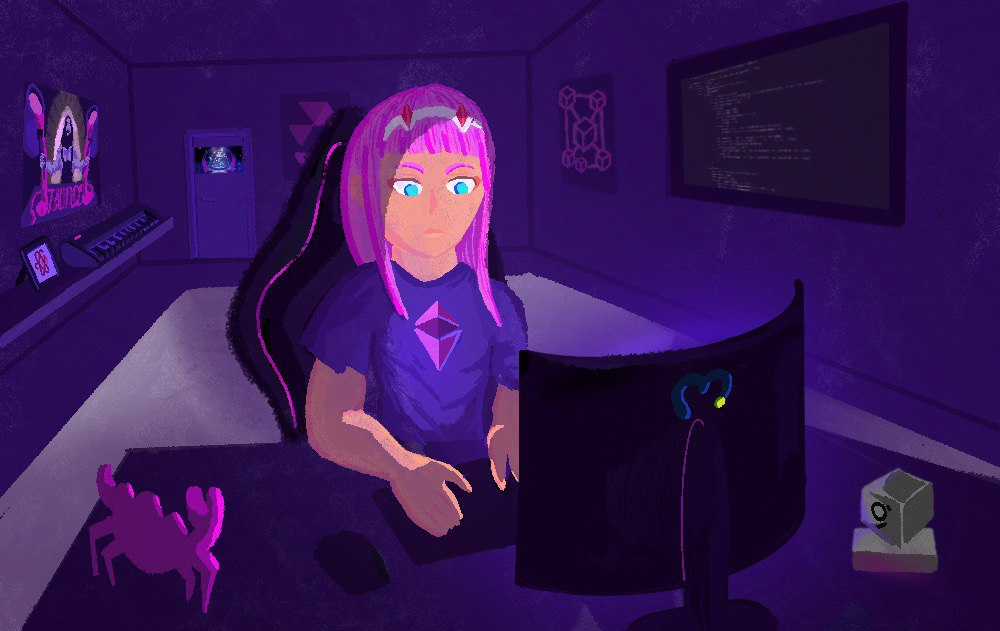
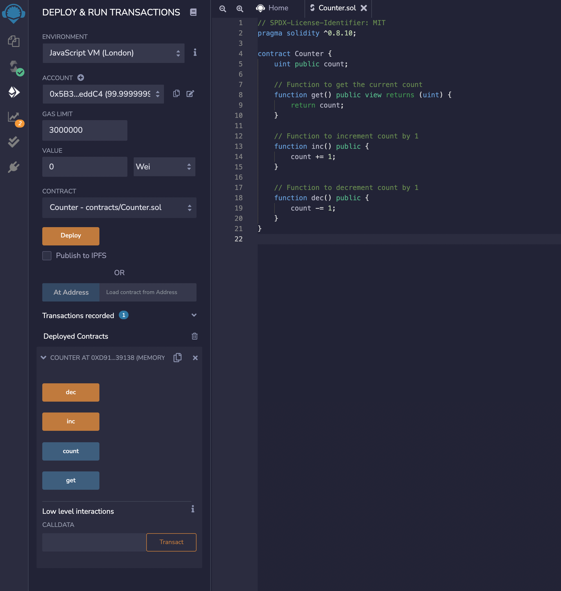
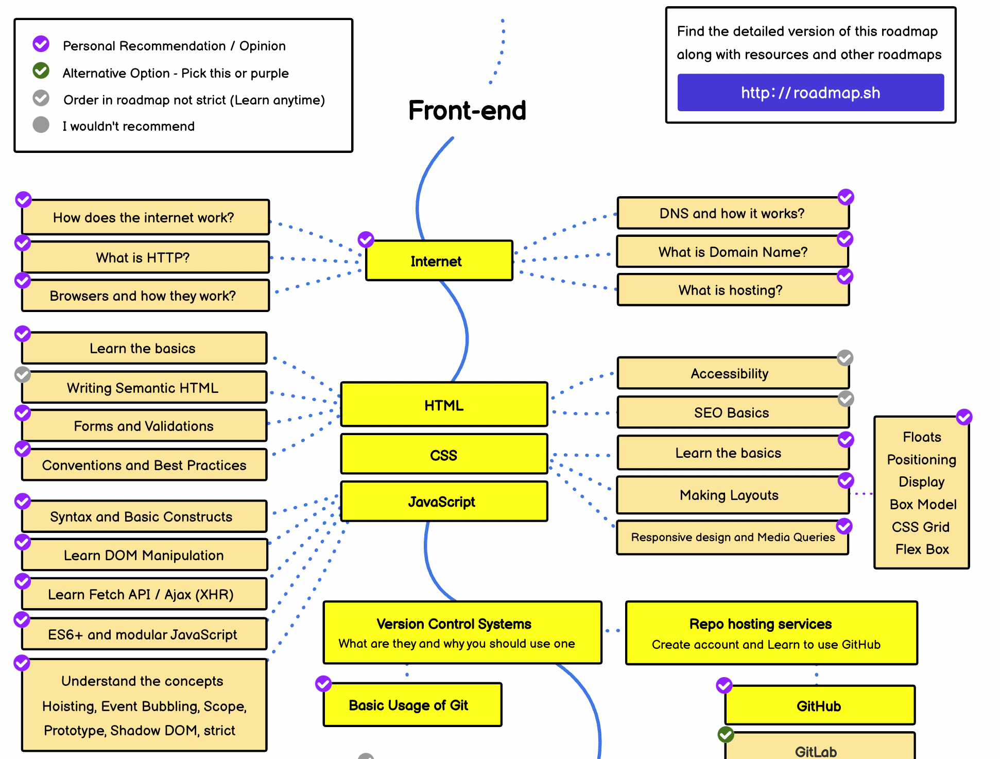
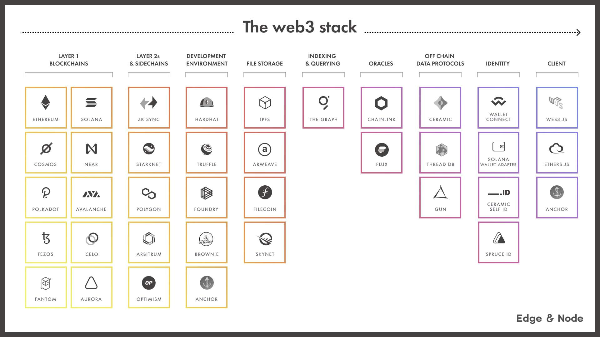
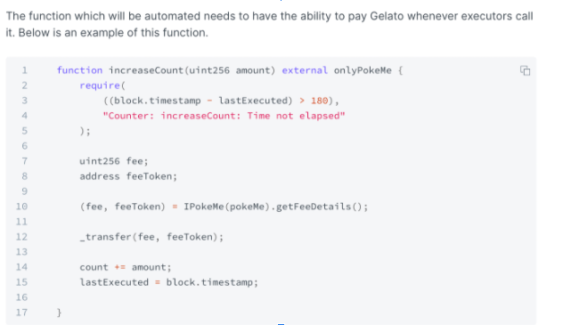

# DevPill.me - A Public Good Blockchain Development Guide



## Support this public good

I’m trying to gather resources to fund the development of this public good blockchain development guide and so I got my fren Ana Rueda (@ruedart) to create this amazing graphic for the [Mirror NFT edition](https://dcbuilder.mirror.xyz/PLNPOmKkYaP14kJa5A5pJgyIlg4dWHpjDiHS7BGC7J4). The funds will go to the continued development of this guide (90%) and to Ana for the creation of the art (10%). I’m open to discussion on how to structure the open collaboration around the guide and to allocating the funds into a community-owned multi-sig. The goal is to use the funds gathered on Mirror, Gitcoin grants round 13 and elsewhere to incentivize developers to create sections through bounty submissions. If this idea doesn’t gather appeal, then I will send the funds to the Gitcoin grants matching round so that other public goods get funded. Links to support the development of the blockchain development guide:

- [Mirror NFTs](https://dcbuilder.mirror.xyz/PLNPOmKkYaP14kJa5A5pJgyIlg4dWHpjDiHS7BGC7J4)
- [Gitcoin grants](https://gitcoin.co/grants/4975/devpillme-a-public-good-blockchain-development-gu) (Gitcoin grants round 13 goes from march 9th - 24th, happens recurrently every 3 months)

## Contributors

If you want to contribute, please join [this Telegram group](https://t.me/devpillme) that I created for collaborators so that we can better coordinate and distribute tasks. Eventually we will migrate to a more suitable Discord/Forum setup.

## Introduction

Nowadays there are countless well-made resources on how to learn blockchain development of all kinds and with different specializations in mind, however, it is still very hard to get guidance and personalized suggestions based on your interests. I am writing this guide in order to provide an aggregator of all the resources that I've found over the years, plus give some opinionated commentary on how to approach them and how to use them in order to maximize learning and practical understanding in order to get building cool things in the space as soon as possible.

This guide will focus on the Ethereum ecosystem as that's where most developers and applications are. If you are interested in other ecosystems that are non-EVM compatible and are not L2s on Ethereum, then check out their respective documentation or guides written by their developer communities. Examples of other non-EVM compatible blockchains that are popular are Solana (Rust/Anchor), Polkadot (Rust/Substrate), Cosmos, Terra, and others. Most of these blockchains do or will support the EVM stack through various initiatives like Neon EVM (Solana), Moonbeam/Moonriver (Polkadot/Kusama), EVMOS (Cosmos), etc.

I really want this guide to become a community-sourced public good that everyone will be able to take advantage of. I will do my best to present it to the wider blockchain developer community to get constructive feedback, proofreading help, and insight into how to make it the best available guide available. 

### What is blockchain development?

There are two main categories in my mind, either you build the infrastructure that runs blockchain-based networks or you build applications that run on top of these decentralized and permissionless networks. Of course, this differentiation doesn't encompass all types of development on blockchains, but it is a good way to get started. 

By blockchain infrastructure, people usually mean client implementations of blockchain protocols that nodes or validators run to keep the chains running. These clients are usually focused on distributed ledger technology, networking, virtual machines, and various other low-level types of engineering. The client is what enforces the rules of the blockchain protocol, runs the consensus mechanism, that executes all transactions in the network and makes sure all nodes are in sync, and more. This is also known as core blockchain development, which is not what most devs picture when thinking about blockchain or web3 development in general. There are various niches within blockchain development itself as well; you can focus on improving execution capabilities with technologies like rollups, validiums, or volitions, you can improve decentralization and security guarantees by innovating on the consensus layer of the protocol, etc.

There's also blockchain infrastructure that supports the application layer by providing APIs to access blockchain data like oracles for smart contracts, indexing services for back ends, libraries that allow you to call and listen to smart contract events, decentralized storage services, and more.

The most popular type of blockchain development is on top of the application layer. Building decentralized applications (Dapps) can take many different forms, but it usually involves a smart contract and a user interface that interacts with that smart contract and listens to changes in the state of the blockchain. These applications can serve various use cases and can be used to build decentralized financial services, games, and so much more.

There are also applications that aggregate data from different smart contracts, transactions, and events on the blockchain to provide useful insight, these apps are mostly centered around data analysis and are not necessarily decentralized, but require an understanding of the underlying blockchain-based technologies.

If these concepts are completely foreign to you I suggest reading the how to get started section first, or Google the words you may not understand.

### Specializations

There are many different specializations within blockchain development, each requires a different set of skills, however a general understanding of distributed systems, basic cryptography, and knowing how smart contracts operate is required as a foundation for all of them. In this guide I'll try to provide a general overview of each of them as well as give the best guidance I can provide on the resources learners should prioritize and in which order they should take them. There are many roles that I'm not as familiarized with, so feel free to suggest pull requests with changes or DM with suggestions.

#### Skill-based

There are different sets of skills required for different specializations, the technology stack and knowledge needed are determined by the layer and application that you want to target as a developer. I believe that everyone should get a solid general foundation and try out different areas and niches before settling on the main stack they want to focus on. Some people choose specializations according to the end goal that they want to accomplish using blockchain-based technologies, others like myself feel like everything is interesting and can't settle on a single one to specialize in when confronted with an analysis paralysis situation.

This guide will cover these main tracks, however anyone is free to submit a pull-request to add more or expand on the already existing ones:


- [Frontend development](#front-end-development)
- [Smart contract development](#smart-contract-development)
- [Backend blockchain development](#backend-development)
- [Core protocol development](#core-protocol-development)
- [Full-stack blockchain development](#full-stack-blockchain-development)
- [Cryptography](#cryptography)

**Coming soon**

- [Security engineer](#security-engineer)
- [MEV searcher](#mev-searcher)
- [Cryptography](#cryptography)
- [Blockchain data analytics](#blockchain-data-analytics)

#### Application-based

Another way to separate types of blockchain development is not based on the underlying tech stack, but on the use case that you are targeting. These are the categories that I believe are the most popular, however, there are many others that I'm not covering to keep the scope of this article more manageable. 

**Coming soon**

- [DeFi](#defi)
- [Creator Economy](#creator-economy)
- [MEV](#mev)
- [L2s](#l2s)
- [Infrastructure](#infrastructure)
- [Gaming](#gaming-development)
- [Privacy](#privacy)
- [Coordination / Public goods](#coordination--public-goods)

#### Non-technical sections

- [Getting a job](#getting-a-job)
- [Social Capital](#social-capital)
- [Mastery](#mastery)

## How to get started?

No matter if you are a beginner programmer or if you've been coding for years, this guide will provide resources for all levels of expertise. If there is something that you already know in the specialization roadmaps that I have here, feel free to skip the material or use it as an opportunity to review what you already know and potentially fill in some gaps in your understanding.

Blockchain development might seem very intimidating at first, there are many moving parts, foundational knowledge from various different fields is required, the technologies are constantly evolving and aren't as mature as in other areas of development such as in the web development space, there is a financial aspect to almost every application as you are programming on top of a value layer, etc. However, it is not as hard as you might think. Once you get familiarized with the basics, understanding everything else that is going on is usually just a matter of applying a general understanding to a specific situation. If you build a strong foundation then it will be much easier to process more complex topics and reason about problems relating to a new subject matter.

If you have a background in computer science, mathematics, or any related field, then you will have a much easier time getting started with blockchain development as many foundational concepts are abstractions of algorithms and data structures. If you are a complete beginner then please make sure you take the initial few steps with patience so as to not feel overwhelmed. Once you start familiarizing yourself with the material you will start to feel like it is more manageable.

### General foundation

In order to get started with blockchain development on Ethereum, one must first get started with understanding how blockchains work in order to build a mental model of how each moving piece works and to get an understanding of the design principles which will govern your development experience.

#### Blockchains

The term blockchain has two different meanings, it can either relate to a data structure or to a computer network. 

A blockchain (data structure) consists of sets of transactions or data bundled inside a container where each container has a cryptographic [hash](https://www.youtube.com/watch?v=QJ010l-pBpE) of the data in the previous container (block) within it. If the contents of the previous block change, the hash changes as well and thanks to this feature we can assure that the data hasn't been tampered with. The second consequence of the blockchain data structure is that it is append-only. You can't prepend data to it, nor modify the data already within it, as that would alter the hashes of all the blocks succeeding the ones that have been modified. This is why we call blockchains immutable.


A blockchain (network) is a network of computers that have a synchronized ledger of transactions that uses the blockchain (data structure) for storing data (usually inside of merkle/verkle trees). The blockchain is powered by miners/validators which operate under a so-called consensus algorithm, this algorithm helps coordinate who produces and organizes blocks as well as indicating which is the longest chain, by updating the head of the blockchain continuously. Blockchains have 3 main properties which they try to optimize for; Security, Decentralization, and Scalability. They achieve security and decentralization through their consensus algorithm where many different parties need to either provide resources mostly in the form of running expensive operations on massive hardware facilities with [Proof-of-Work](https://en.wikipedia.org/wiki/Proof_of_work) (PoW) or by staking economic resources in the network with [Proof-of-Stake](https://ethereum.org/en/developers/docs/consensus-mechanisms/pos/) (PoS). The more participants and the more distributed the power dynamics among those participants, the more security and decentralization. There are many other features that contribute to decentralization, like client software which is able to be run on consumer hardware so that anyone can synchronize the state of the blockchain in their nodes, minimizing how many transactions you can process per block so as to not make the state of it too big and much more. 

- **Further reading**

In order to understand how blockchains work beyond my simple explanation here read and watch the following resources:
- [Blockchain Explained - Investopedia](https://www.investopedia.com/terms/b/blockchain.asp)
- [Blockchain 101 - Anders Brownworth](https://www.youtube.com/watch?v=_160oMzblY8)
- [But how does Bitcoin actually work? - 3Blue1Brown](https://www.youtube.com/watch?v=bBC-nXj3Ng4)
- Optional (cultural significance): [Bitcoin whitepaper](https://bitcoin.org/bitcoin.pdf)


#### Ethereum

Since this is a guide about blockchain development on Ethereum, it is required to know how the Ethereum blockchain works, and the changes that it will undergo in the future so as to be prepared for what's to come as a developer. If you have done web development before you can think of changes as a new ECMAScript standard, a new browser compile target (ie. WASM), a new engine (V8), etc... The Ethereum blockchain is constantly evolving and quite a few changes will be put in place in the future before the core technologies of the network will start to ossify.

A good way to get started with how Ethereum works is to watch [Austin Griffith](https://twitter.com/austingriffith)'s [ETH.BUILD YouTube playlist](https://www.youtube.com/playlist?list=PLJz1HruEnenCXH7KW7wBCEBnBLOVkiqIi) where he illustrates how various parts of the Ethereum blockchain work.

"In the Ethereum universe, there is a single, canonical computer (called the Ethereum Virtual Machine, or EVM) whose state everyone on the Ethereum network agrees on. Everyone who participates in the Ethereum network (every Ethereum node) keeps a copy of the state of this computer. Additionally, any participant can broadcast a request for this computer to perform arbitrary computation. Whenever such a request is broadcast, other participants on the network verify, validate, and carry out ("execute") the computation. This execution causes a state change in the EVM, which is committed and propagated throughout the entire network." (source: [ethereum.org documentation](https://ethereum.org/en/developers/docs))

In order to learn the basics of Ethereum, go through the [ethereum.org documentation](https://ethereum.org/en/developers/docs). Here are links for each section:

- [Intro to Ethereum](https://ethereum.org/en/developers/docs/intro-to-ethereum/)
- [Intro to Ether](https://ethereum.org/en/developers/docs/intro-to-ether/)
- [Intro to dapps](https://ethereum.org/en/developers/docs/dapps/)
- [Web2 vs. Web3](https://ethereum.org/en/developers/docs/web2-vs-web3/)
- [Accounts](https://ethereum.org/en/developers/docs/accounts/)
- [Transactions](https://ethereum.org/en/developers/docs/transactions/)
- [Ethereum Virtual Machine (EVM)](https://ethereum.org/en/developers/docs/blocks/)
- [Gas](https://ethereum.org/en/developers/docs/evm/) (skip the Opcodes section, we'll revisit that later)
- [Nodes and clients](https://ethereum.org/en/developers/docs/gas/)
- [Networks](https://ethereum.org/en/developers/docs/nodes-and-clients/)
- [Consensus mechanisms](https://ethereum.org/en/developers/docs/consensus-mechanisms/)
- [Governance / EIP process](https://ethereum.org/en/governance/)
- **Ethereum roadmap - Endgame**

[This graphic](https://github.com/dcbuild3r/blockchain-development-guide/blob/main/images/ethereum_roadmap.png) shows all the different changes which are being implemented to Ethereum in the upcoming years. It's not necessary to understand what this is all about, but it is good to know about. I suggest watching the video resource appended after the graphic to learn more about what these flowcharts mean.

- **Further reading**
  - [Ethereum Whitepaper](https://ethereum.org/en/whitepaper/)
  - [Why Proof of Stake - Vitalik Buterin](https://vitalik.ca/general/2020/11/06/pos2020.html)

#### Smart contracts

A smart contract is a program that runs on the Ethereum blockchain. It's a piece of code that has functions and data (state) which resides at a specific address on the Ethereum blockchain.

Smart contracts are a type of [Ethereum account](https://ethereum.org/en/developers/docs/accounts/) meaning that they have a balance and can send transactions over the network. They are deployed on the network and run as programmed, user accounts (externally-owned accounts, or EOAs) can interact with a smart contract by submitting transactions that interact with functions that are publicly accessible. Smart contracts can be used to define rules which are enforced via code, e.g. a smart contract that allows for two parties to swap their tokens (like Uniswap).

**How do I create a smart contract?**

The most popular smart contract programming language which targets the Ethereum virtual machine is [Solidity](https://docs.soliditylang.org/). It is a high-level language that was influenced by C++, Python, and Javascript and so its syntax looks familiar. Solidity is statically typed, supports inheritance, libraries, user-defined types, and more. Solidity is a compiled language, which means that before having a runnable smart contract, a Solidity program needs to be run through a compiler that generates a low-level interpretation which is called bytecode. Bytecode are instructions that the EVM can understand and execute.

There are other languages that can be used to target the EVM like [Vyper](https://vyper.readthedocs.io/en/stable/toctree.html) and [Fe](https://fe-lang.org/) that have their pros and cons, however, they don't have as robust development ecosystems and aren't as widely used by projects deployed in production. 

Here's how a [simple counter program](https://solidity-by-example.org/first-app/) would look like in Solidity:

```js
// SPDX-License-Identifier: MIT
pragma solidity ^0.8.10;

contract Counter {
    uint public count;

    // Function to get the current count
    function get() public view returns (uint) {
        return count;
    }

    // Function to increment count by 1
    function inc() public {
        count += 1;
    }

    // Function to decrement count by 1
    function dec() public {
        count -= 1;
    }
}
```

In the beginning, you declare the version of Solidity you are using the `pragma solidity + version` keyword. To indicate the creation of a contract you write it using the `contract ContractName {}` form. Within the contract curly brackets, the logic of the program is declared. We then declare a simple variable with the name `count` with unsigned integer type (meaning it can only hold positive integers). Afterward, we declare three different functions, one to retrieve the value held inside of the `count` variable, one to increase the variable's value by one, and the last one to decrement its value. The `public` keyword specifies that the function can be called by any address on the blockchain (be it a smart contract or a user-owned account). The `view` modifier specifies that the function doesn't alter the state within the contract (it only reads values already available). The `returns` keyword is used to specify the type of the object that is returned back by the function, unsigned integer type in the case of the `get()` function. Everything which is written after a `//` is considered a comment and is ignored by the Solidity compiler. Comments are used to make the code more readable and manageable, which is especially helpful if you are working with teams or revisit a codebase after some time. It also acts as documentation for what the code it is doing.

**How do I compile and deploy my first contract?**

In order to compile and deploy our first smart contract, we will use the Remix IDE which is a website where we can write smart contracts, compile them and deploy them on a local instance of the EVM. We can also interact with the local deployed smart contract to test out its functionality. To deploy our simple counter contract, go to [Remix](https://remix.ethereum.org/), add a new file in the contracts directory, name it `Counter.sol`, and copy-paste the code in the [counter example](https://solidity-by-example.org/first-app/). Now click on the second icon from the top in the selection bar on the left, it is the logo of the Solidity programming language and it symbolizes the Solidity compiler in Remix. In the compiler dropdown select 0.8.10 which is the Solidity version in our smart contract and click "Compile Counter.sol". After you have compiled your contract click on the third icon from the top, it should have the "Deploy & Run Transactions" name. Click "Deploy". After you have deployed, you should see a list item with "> COUNTER AT 0x.... (MEMORY). You've successfully compiled and deployed your first smart contract! Now that you have it deployed, you can interact with it by calling the `inc()` or `dec()` functions to increase or decrease the value of the `count` variable. You can call the `get()` function to retrieve the value of the `count` variable.



We will go into a lot more depth on how smart contracts are programmed, tested, and deployed in the smart contract development section.


#### Web 2.0 

Although blockchain developers build decentralized applications, the technologies used to build these applications overlap to a big extent. User interfaces for Dapps are hosted on the internet and are built with traditional web technologies. In order to interact with a smart contract, a user needs to submit a request to a server that hosts an application and that application needs to create a transaction, get the signature from a user via a web3 wallet like Metamask, and then submit the transaction to an Ethereum RPC. The transaction then goes to the mempool, gets picked up by a miner (PoW) / validator (PoS), gets executed and included in the blockchain, and the user interface updates once the blockchain emits an event with a successful call of a function inside of a smart contract. This is the usual flow that decentralized applications have.

Any blockchain developer that wants to build full-stack applications needs to know how the internet and its most important protocols work as well as how to build user interfaces for all the major platforms (web, mobile, etc). You can think of web3 as adding a native value layer to the internet, it also helps with social coordination and resource allocation with the decentralized autonomous organization structure. It is very helpful to know how the web and the existing technologies built on top of it work and understand how crypto and web3 work in order to create better applications.

I believe that even though you might not work with developing front-ends it is still good to know how they work on a foundational level as in almost all kinds of development you'll interface with the web in some form. A good learning roadmap for the basics of how web technologies work is the [roadmap.sh frontend](https://roadmap.sh/frontend) initial steps in the roadmap. It is also a must to learn how to version control your code, Git is the most popular version control and collaboration software along with GitHub / GitLab for hosting repositories and interacting with other coders.




- **Learning resources**
- [How does the internet work](https://www.youtube.com/watch?v=zN8YNNHcaZc)
- [CS50 HTTP lecture](https://www.youtube.com/watch?v=PUPDGbnpSjw) (the [CS50 course](https://www.edx.org/course/introduction-computer-science-harvardx-cs50x) on edX is a great intro into computer science)
- [freeCodeCamp](https://www.freecodecamp.org/) - Here you can learn the basics of how HTML, CSS and JS works. Unless you're planning to write frontend interfaces you won't need it, but it's still good to experiment and learn how it works.

#### What makes decentralization important?

In the web 2.0 world, we're used to have a main account on platforms like Google and Facebook which we use to log into other services. All of our data is hosted inside of centralized databases and our private information is used in advertising software to sell us products. In exchange for our data, we get free services. These big centralized entities have a lot of power and control over our daily lives through the products we use each and every day. This is the business model which has worked for the past few decades.

When you decentralize the services and become a sovereign user, you can't be de-platformed, censored, or exploited. As long as you have access to a computer and to the internet you can use any application running on a permissionless and decentralized blockchain. Nobody can block access to them fundamentally, because you can always run a node and submit a call a smart contract and submit a transaction in the blockchain network. Decentralized applications are still in their infancy and many technologies are still not mature enough to support mainstream adoption, however, there is a huge demand for these applications and the industry is evolving rapidly.

In a web3 world, users own their assets, their money, their identity, and their data. This allows for a better user experience fundamentally, and even practically once these technologies become mature enough to support the masses. You can eventually have applications like decentralized social networks where users own their content, artists and musicians can produce their artwork and sell it as NFTs and get revenue from royalties and better engaging with their audiences, you can have virtual worlds where people own their digital identity, their virtual items, and their land, etc. The possibilities in web3 are growing day by day and I think it is one of the most exciting technologies that humankind has ever devised. It unlocks so much potential. 

### Web3 values

The web3 movement is one about creating a value layer for the internet where we can setup incentive structures for the betterment of society in order to make a fairer world where access to products and services is openly distributed, permissionless and accessible to everyone on the planet no matter their provenance. 

There are many good initiatives like [Kernel](https://kernel.community/en/), [Gitcoin](https://gitcoin.co/), [GreenPill](https://greenpill.party/) and many others that try to help educate about and fund the new wave of public goods and inrastructure in order to create a better world. As a blockchain developer, it is good to get a feeling for why these systems are built out in the first place and the values the products and services we create embody so as to not recreate the  centralized web2 world we currently have. 

In order to learn more about web3 values and how we can create a fairer world, go over [Kernel's web3 lessons](https://kernel.community/en/learn/).

### Play around

Blockchain development might feel overwhelming, and frankly very intimidating when you are starting out. To remedy this feeling, I suggest you look at programming on blockchains like an adventure game. You can explore what is possible, experiment by creating small projects with technologies that you find interesting, looking at what other people are building and interacting with their applications, debate with various people about their favorite applications, technologies and get a feel for how everything works. 

As you progress through this guide, you'll start going deeper into various different fields. There is a myriad of interesting primitives in web3 and types of applications you could build and so to pick what to specialize in from the get-go is very hard unless you have a clear goal in mind from the get-go which is quite rare. I personally think that trying everything that interests you if at least for a short while can get you a glimpse into that field and give you insight on whether you'd like to focus on that particular area. For this I suggest getting into different developer and research groups and talking about how is it like building those things, what are the types of problems you would be working on, how does one get better in that field, what is there to work on, etc. One of my favorite such groups is [Newt](https://twitter.com/wearenewt) which is Aave's experimentation branch. Newt is completely community-driven and tries to promote open-source experimentation where the community is welcome to contribute to existing experiments or create their own. Here you can meet like-minded developers, build cool projects, explore different areas of development and different fields within web3 such as DeFi, NFTs, and more. [DeveloperDAO](https://twitter.com/developer_dao) and [EthernautDAO](https://twitter.com/EthernautDAO) are also good developer communities where you can search for like-minded individuals and explore the possibilities of what's possible in web3, and potentially even getting full-time job offerings. 

### Connect

Blockchain development is a fairly new field and so most information about how to build applications in web3 is available on the internet and not in universities and other educational institutions. This might make it a lonely endeavor, but it need not be! There are people all across the world learning how to build cool projects with these technologies and everyone is looking to learn from each other and make friends in the space. As mentioned before, join DAOs and groups like Newt, DeveloperDAO, EthernautDAO, etc, talk about your learning journey on Twitter and try to provide insight into your experience with learning these technologies. You're bound to find like-minded individuals with whom you can share your interests, it helps a lot with learning the material as when you have to explain a complex topic to a person without former knowledge, it forces you to understand your subject very well in order to explain it simply. Pair-programming or pair-learning is also a good way to cement new learnings. Personally, I found that making friends online that are also into blockchain development is what made it the most fun and engaging for me and is helping me stick with the material for longer periods of time than I otherwise would have. 

Twitter is currently the platform where most builders, researchers, and creators share their insights in the realm of blockchain and web3, so it is almost a must if you want to keep up with the newest technologies. I also recommend to not overdoing social media as it can lead to a drastic decrease in productivity. It's a balance that needs to be achieved over time, a good tip is that whenever you want to check Twitter or Discord you have a clear goal in mind, e.g. goal: I want to learn what new gas optimizations have my friends come up with? I also recommend creating lists with different types of people so you can sort by the type of content you want to see (DeFi, NFTs, MEV, smart contracts, frontend, design, etc).  Bookmarking is also a good feature if you want to revisit interesting tweets in the future.

Another great way to meet devs is to go to hackathons and conferences. If you can afford to go to events then definitely do, however, if you don't have enough funds there are oftentimes grants for first-time attendees through places like [PadawanDAO](https://twitter.com/PadawanDAO), and others. Usually asking around to volunteer will get you a free entrance and people are usually kind enough to pool funds to sponsor people looking to get into the space that doesn't have the means to afford to travel by themselves. In-person events like hackathons are a great way to develop your skills and meet people. It's where many projects that are popular today were started and the place where founders of projects usually meet for the first time. As for events worth going to in 2022, I suggest [Devconnect](https://twitter.com/EFDevconnect) (Amsterdam), [ETHPrague](https://twitter.com/EthPrague), [ETHCC](https://twitter.com/EthCC)/[ETHParis](https://twitter.com/ETHParis) and [Devcon](https://twitter.com/EFDevcon) (Bogota). Here is a [good list](https://docs.google.com/spreadsheets/d/1NEu_FCc1hnGAuRgPmbXXpf0h2lCrCOlMKbbFEqgkVDQ/edit#gid=0) with Ethereum-related events in 2022, there are also events on pretty much every continent and there are also small local events that different communities organize, so look for events near you that might be related to blockchain development in some way or start one yourself!

I also recently started creating a [Twitter list with blockchain devs](https://twitter.com/i/lists/1483458041412526084) that I think you should follow if you want to learn blockchain development. It is a running list so feel free to DM me devs I should add and I'll consider adding them to the list.


### Build

The next and final step to get started with blockchain development should be obvious by now, it is to actually start building! After you've gone through the introductory foundational material that I wrote in the sections above you are ready to get going with one of the specializations listed below. If you are not sure which one you're into yet, just go with full-stack blockchain development and you'll get to try a bit of everything! Start writing code, no matter how bad it is, and try to get feedback on it from devs that know more than you do. Go through the roadmap that I have specified below, learn a concept, take notes, build something around it, do some testing and move on. If there is something that catches your attention, then try building something with it and see where it takes you. Your own curiosity and interest are your best friend when learning blockchain development. You should constantly ask yourself why did the thing that I wrote worked and how I could make it better, if you can't come up with an answer you either ask someone for an explanation or for a code review. It is also good to review quality code written by other teams. If you are learning Solidity, for example, the best way to learn advanced Solidity is to read into production codebases like Aave v3, Uniswap v3, Balancer v2, etc. The same principle applies to other categories and specializations as well. 

Once you build something, share it with the world (unless it's a very profitable MEV bot)! Sharing it on Twitter and different Discords will bring attention to what you're doing and you might get constructive feedback and/or meet new friends that are interested in what you are building. If you are building something more complex, try creating documentation for it or make some useful comments if you expect other people to read your code. It is also great to share code and make it publicly available on hosting platforms like GitHub to build a portfolio of projects which you can showcase in order to show other people when applying for job positions. I'll revisit how to get employment in web3 in a later section. 

## Skill-based development

Now we get down to different specializations, before getting started looking at different paths you can take make sure you've gone through the [Foundational section](#general-foundation). I also suggest reading the introduction to each specialization in both the [skill-based development](#skill-based-development) and [application-based development](#application-based-development) categories so that you have a better idea of what's out there and what you might find interesting before going deeper into any specifical one. This section will focus on categorizing specializations in blockchain development with regard to the skillsets required within them.

### Front-end development
Front-end (FE) development is highly reminiscent of traditional web (“Web2”) development. This includes the technology stack involved in building out user interfaces connected to blockchain technology. 

Just like in traditional environments, FE blockchain developers are expected to fetch data and interact with APIs in order to produce a seamless user experience on a decentralized application.

As a result of the overlap in these core competencies, front-end developers are able to leverage a mature ecosystem of tried and true languages, libraries, and various other tools that will be covered in this section. 

Additionally, these similarities contribute to a much more frictionless onboarding process for developers who are new to frontend development. These developers are able to tap into a mature ecosystem composed of developers who eagerly impart their knowledge via platforms such as [StackOverflow](https://stackoverflow.com/). This also extends to the availability of well-produced tutorials and documentation for grasping these well-established technologies. Note, however, that this is not the norm in such a rapidly emergent ecosystem, such as Web3, which makes frontend development the most popular choice amongst those new to blockchain technology.

The key principles of front-development require knowing how to structure and style websites, how to make them dynamic with JavaScript and different frameworks, how to manage state within applications, basic design, how to fetch data from APIs and databases, and how to create good web3 user experiences regarding wallets and the interactions with the smart contract backend of your application. One of the biggest differences in web3 FE development is user-authentication as instead of logging in with your email and password or your Google account, you log in with your wallet using a third-party application like [Metamask](https://metamask.io/) or [WalletConnect](https://walletconnect.com/) and protocols like [ENS](https://ens.domains/) to display information about the user (provided they have an Ethereum domain). If a smart contract contains a state which represents past interactions with the application by the user, you also need to fetch historical data from the blockchain on-demand or maintain a local database with indexed data which is easily queriable by the FE of the application. 

As a front-end blockchain developer you need to know what a Contract Application Binary Interface ([ABI](https://docs.soliditylang.org/en/v0.8.11/abi-spec.html)) is in order to be able to interact with smart contracts on the Ethereum blockchain or on an L2 like Optimism, Arbitrum, Starknet, or ZkSync which are Ethereum-based scaling solutions that we'll cover in the [L2 section](#l2). You also need to query data from various APIs to accurately display the price of various assets (if applicable), the user's balance of ERC20 tokens or NFTs, and various other data you might need from either the blockchain itself or an external database.

Another interesting feature of programming decentralized applications is the need for building applications that are not hosted on a centralized server, to remedy this problem many developers have their web interfaces open-sourced and have many instances of those interfaces on decentralized storage solutions like IPFS, Arweave, and others. In this way, if one of the servers hosting the interface to interact with the smart contracts goes down, users can interact with it from many other different places. It's also amazing that since the functions are able to be called by anyone, users can interact with decentralized applications from completely different frontends as long as they have the ABI, this allows for massive composability which we'll cover a bit later.

This roadmap will focus on the frontend technologies that I've seen are mostly used in blockchain development today. I've used the roadmap.sh frontend roadmap, a friend's tech stack, and my experience as a reference for creating this specialization.  If you are a more experienced reader feel free to suggest pull requests to add/edit/remove content or you can suggest changes by DMing me on Twitter or Telegram (@dcbuild3r).

#### HTML, CSS, JS, Web APIs

The pillars of web development technologies are HyperText Markup Language (HTML), Cascading Style Sheets (CSS), JavaScript (JS), and web application programming interfaces (APIs). 

[HTML](https://en.wikipedia.org/wiki/HTML) is the language that is used to structure websites, with HTML you can insert text, images, videos, create different sections for your website, create links to other sites, and more. [CSS](https://en.wikipedia.org/wiki/CSS) is a styling language that helps you edit how your HTML elements look, how they are displayed and how they are arranged on your screen. It is also what makes user interfaces responsive for different devices like mobile, tablet, laptop, desktop, and others by providing APIs which dynamically resize your HTML elements based on the width and height of the screen a specific user has. [JavaScript](https://en.wikipedia.org/wiki/JavaScript) is a programming language that makes your HTML elements dynamic, it allows for things like complex animations, dynamic formatting of elements depending on given inputs, state management within your application, much more utility thanks to its programmability, and more. HTML, CSS, and JavaScript are the only 3 technologies that browsers understand, the rest of the technologies mentioned in this specialization end up compiling to an optimized HTML, CSS, and JS bundle which the browser can process and interpret.

The best place to learn the basics of web development in my opinion is [freeCodeCamp](https://www.freecodecamp.org/) where you can do the lessons in the first two sections named "Responsive Web Design" and "JavaScript Algorithms and Data Structures". It says that each section takes about 300 hours each, but usually, you can do it in much less since it's a conservative estimate. After you've gone through these two sections and made the initial projects that are required to fulfill them you can move on to learning React. 

#### React

In modern web development, you'll almost never write vanilla HTML, CSS, and JavaScript to build your websites. Web developers learn a view framework that helps them to better structure their code with components and also optimize the way in which components are rendered and how changes to the state of the application affect what the users see. The most popular web development framework is React with a wide margin compared to Vue.js. React was originally developed by the Facebook team, but was open-sourced early on and now it has thousands of contributors and many full-time maintainers who are constantly pushing the framework forward.

Most of the user interfaces for blockchain applications are programmed using React and there are many React component libraries that you can reuse from the community to perform common tasks like logging with an Ethereum wallet, switching networks, and also so-called React hooks libraries (i.e. [eth-hooks](https://github.com/scaffold-eth/eth-hooks)) which let you fetch different data like balance, block number, prices and more.

I believe that React is best learned from the official documentation, but there are also other resources for people that learn better with video content. Here is a list of React learning resources that I recommend:
- [React in 100 Seconds - Fireship](https://www.youtube.com/watch?v=Tn6-PIqc4UM)
- [React roadmap](https://roadmap.sh/react)
- [Official React documentation](https://reactjs.org/docs/getting-started.html)
- [awesome-react](https://github.com/enaqx/awesome-react) - This GitHub repository aggregates many useful resources for React developers, it has tutorials, tooling, component libraries, frameworks, design patterns, guidelines, and much more. It is a good place to look for inspiration and resources when using React.
- If you want a paid video course I can recommend either [ZTM's React course](https://www.udemy.com/course/complete-react-developer-zero-to-mastery/) or [Maximilian Schwarzmuller's React course](https://www.udemy.com/share/101Wby3@JDt64oz7fMQjMAWBtrmk5wuDfzeEWDYkQeRN1yCa5yjMEWG0cKPDILlqSqtSXEI7/). On Udemy there are sales periods every once in a while which allow you to buy courses for `$15` instead of `$200`, so wait for one of those, never buy for the full price.
- [freeCodeCamp React course on YT](https://youtu.be/bMknfKXIFA8)
- [Learn React for free](https://scrimba.com/learn/learnreact)

After you feel like you've understood how React works, you have learned about lifecycle methods, hooks, how to pass down data through props, how to use the Context API, etc. I recommend trying to build the front end of a web3 app like Uniswap or an NFT marketplace like OpenSea. To rapidly prototype the design I recommend using [tailwind.css](https://tailwindcss.com) and Chrome browser developer tooling to inspect the styles of the site you're trying to recreate. Also, don't forget to use CSS flexbox/grid where necessary. Try to simulate the data inside of these apps using hardcoded JSON objects.

#### Typescript

[Typescript](https://www.typescriptlang.org) is a superset of JavaScript which allows you to statically type JavaScript code. This means that you declare the types of variables (integer, string, ...). It allows for a better developer experience as the Typescript compiler can catch many errors ahead of time since it checks the types of the objects ahead of time. It also allows developers to tap into extra features on top of JavaScript which allows writing more expressive JavaScript. Remember that Typescript cannot be run by the browser and needs a compiler to convert TypeScript code into runnable JavaScript. Typescript is widely used by the web-development community thanks to its features that improve security, readability, allow for a better development experience inside of the IDE with autocompletion, and add cool new syntactic sugar on top of JavaScript.

I recommend going to the [Typescript documentation](https://www.typescriptlang.org/docs/handbook/intro.html), it is good to get into the habit of going to official documentation since they are usually the right place to visit if you are learning new technology. Once you have the basics down try building a simple application with it or refactor an existing application in a way that uses the technology that you are learning.

#### Next.js

[Next.js](https://nextjs.org) is a React framework that enables server-side rendering, static site generation, does smart bundling, route pre-fetching, and a lot more. Next.js is able to heavily optimize your websites by only loading what you need on-demand instead of having to load up the entire site at the beginning. It also allows for a much better experience with creating API routes thanks to its file-system routing feature, it optimizes images, it has Typescript support, it helps with i18n API internationalized routing, and a lot more.

**Learning resources:**
- [Next.js documentation](https://nextjs.org/docs)
- [awesome-nextjs](https://github.com/unicodeveloper/awesome-nextjs)

#### Moralis

[Moralis](https://moralis.io) is a web3 development platform that helps abstract away the pain of having to build all the backend infrastructure needed to run web3 applications from scratch. Moralis provides an easy-to-use API that lets you fetch any data that you want from various blockchains, handles web3 user authentication, allows you to listen to smart contract events in real time, gives you access to historical data, has support for cloud functions, and much more. If you've never worked with blockchains it is the best way to get onboarded and start building web3 applications, as the Moralis SDK is intuitive to use for anyone that has experience with JavaScript/TypeScript. 

**Learning resources**
- [Moralis documentation](https://docs.moralis.io/moralis-server/getting-started)
- [Moralis YT channel](https://www.youtube.com/c/MoralisWeb3)

#### Web3 libraries

[Ethers.js](https://docs.ethers.io/) is one of the most popular libraries for interacting with the Ethereum Blockchain and its ecosystem. Smart contracts that are deployed on the Ethereum blockchain have functions that can be called externally by any other account on Ethereum, be it an externally owned account (EOA = user wallet) or another smart contract. Many of these functions require certain parameters to be fed into them, they also rely oftentimes on an external state like prices of tokens on the blockchain, balances of the user's wallet, and more. Ethers.js is what allows a user interface to call these functions, users can input certain information in the frontend of your application and that information can be put into the function call of the smart contract, after the transaction is broadcasted the EVM will try to execute that function call and if every check inside of the function doesn't give out any errors it will execute, otherwise, the transaction will revert.

Ethers.js is currently the most popular Ethereum library among developers, but there are alternatives like web3.js, web3.py, Brownie, and many others. The second most popular framework is web3.js and it is the Ethereum JavaScript library that has been around the longest. For a comparison of ethers.js and web3.js read [this article](https://moralis.io/web3-js-vs-ethers-js-guide-to-eth-javascript-libraries/) written by the Moralis developer team.

**Learning resources**
- [ethers.js documentation](https://docs.ethers.io/)


[Web3.js](https://web3js.readthedocs.io/) is a collection of libraries that allow you to interact with a local or remote ethereum node using HTTP, IPC or WebSocket. The web3 JavaScript library interacts with the Ethereum blockchain. It can retrieve user accounts, send transactions, interact with smart contracts, and more.

**Learning resources**
- [web3.js documentation](https://web3js.readthedocs.io/en/v1.7.1/getting-started.html)

#### Design

As a front-end developer, you need to focus on how your application looks and how it feels to use it. A big part of that is designed, before building a website you should prototype how you want it to look, design how your users will interact with your application, how will that fit with the use case of your application, and what you want to accomplish with it, how to make it so that your users like using it and more. UI/UX is a specialization of its own, but every single front-end developer should have strong foundations in UI/UX regardless. Most big teams will have designers which will prototype applications using tools like Figma, Framer Motion, and various other tools. As a front-end developer, your task is to turn those designs into functioning code and hook all of the components to the APIs and databases necessary as well as creating the functionality of the application. 

One of the most popular tools to prototype and design websites is Figma, so every FE developer should know how to use the application. 

**Learning resources**
- [freeCodeCamp Figma YT course](https://youtu.be/jwCmIBJ8Jtc)
- 

#### Web3 templates

When you are building web3 applications you usually start with a template. A template is just a group of libraries, pre-built user interfaces, and another tooling that create a favorable environment to build your application. A lot of the initial hard work to set up a project can be reused across projects to save time and effort on building redundant infrastructure. Many web3 templates have support for smart contracts out of the box which is what you'll be interacting with most of the time as a front-end developer. It is good to know the basics of smart contracts and understand how to get a contract factory out of the ABI to call its methods within your user interface. That's the biggest overhead when building in web3 in comparison to being a frontend developer in web2 where you only have to care about fetching data from REST or GraphQL APIs.


You can build your own templates depending on your needs, or modify already existing ones. Popular web3 templates include
- [moralis-starters](https://docs.moralis.io/moralis-server/getting-started/boilerplate-projects)
- [scaffold-eth](https://github.com/austintgriffith/scaffold-eth)
- [create-eth-app](https://github.com/paulrberg/create-eth-app)

#### Tooling

As a developer, there are many tools you'll use to make building applications easier and more efficient, to collaborate on projects with other people, to manage dependencies, and much more. This is a short section on different tooling you'll find yourself using regularly.

**Package management**

If you've gotten this far in the front-end specialization you've certainly had to install packages like React, Next.js, tailwind.css, ethers.js, and many others. The most popular package managers in the JavaScript ecosystem are `npm` and `yarn`. Package managers allow you to keep track of which versions of which external code libraries your application uses as well as how the project's code is structured, how to run different tests, how to run your program, and various other miscellaneous tasks. 

As you build more complex applications it is good to learn the depths of your package manager, how to structure `package.json` files, how to write scripts that automate the boring stuff, how to set up a CI/CD pipeline (we'll talk about this in a bit), and more.

- [Package management basics](https://developer.mozilla.org/en-US/docs/Learn/Tools_and_testing/Understanding_client-side_tools/Package_management)
- [npm](https://www.npmjs.com/)
- [yarn](https://yarnpkg.com/)

**Styling/Animation**

There are many CSS libraries and frameworks which modify the way in which you write CSS. There are libraries that allow you to write CSS within JavaScript, component libraries for React which have a lot of the styling done for you, animation libraries, and more. I'll mention a few of the most popular ones, feel free to suggest changes as I'm not an expert in the area.

- [styled-components](https://www.styled-components.com/) (CSS in JS)
- [Tailwind.css](https://tailwindcss.com/) (CSS framework)
- [Framer Motion](https://www.framer.com/motion/) (Animations framework)
- [Chakra UI](https://chakra-ui.com/) (component library)
- [Material UI](https://mui.com/) (component library)
- [Next UI](https://nextui.org) (component library)
- [Sass](https://sass-lang.com/) (CSS pre-processor)
- [PostCSS](https://postcss.org/) (CSS pre-,post-processor)
- [awesome-CSS](https://github.com/awesome-css-group/awesome-css) (CSS learning repo)

**Linting/Formatting**

A linter is a static code analysis tool used to flag programming errors, bugs, stylistic errors, and suspicious constructs and a code formatter makes sure that the code you write has a homogenous style structure and abides by the formatting rules of a specific programming language (i.e. [PEP8](https://www.python.org/dev/peps/pep-0008/) for Python). When you're writing code, it's easy to miss a space, a tab, a colon, an opening or closing bracket, or to write code with bad and inconsistent styling. That's where linters and formatters will come in handy as they automate the task, they can be configured to run on saving and on commit, so that badly styled code never gets into production or into a public repo. The most popular choices are:

- [Eslint](https://eslint.org/)
- [Prettier](https://prettier.io/)

**CI/CD**

CI/CD stands for continuous integration / continuous deployment, they are a set of tools that allow you to create automatic processes that execute whenever a change is made to the codebase usually hosted on the cloud so that the production servers running your application get automatically updated with the newly pushed code. These actions can also modify and run tests on the code before it gets pushed into production, if tests fail the commit or update will not go through and collaborators will get notified of this. Once projects become bigger and they have big teams of contributors a solid CI/CD pipeline is very important so as to maximize the security and correctness of code being pushed into production. Examples of popular CI/CD tooling are:

- [GitHub Actions](https://github.com/features/actions)
- [CircleCi](https://circleci.com/)
- [Husky](https://typicode.github.io/husky/#/)

**Testing**

A key part of development is mitigating how many bugs are inside of your application. To ensure that the code behaves as it is intended to we write [unit tests](https://en.wikipedia.org/wiki/Unit_testing), [integration tests](https://en.wikipedia.org/wiki/Integration_testing) or even [end-to-end tests](https://www.browserstack.com/guide/end-to-end-testing). Each kind of test focuses on a different part of the application lifecycle. Modern tooling like Cypress allows you to simulate all possible states of your application and simulate user flows, you can even record user session tests as if you were recording a real user going through your website. In web3 you will also be doing integration tests for smart contract interaction. You can test smart contracts using libraries like [Foundry](https://github.com/gakonst/foundry), [Hardhat](https://hardhat.org/) or [Truffle](https://trufflesuite.com/). Most of these tests will be written by a smart contract or full-stack developer, however, as a frontend developer, you need to test how the interactions with the contracts will influence the flow of the user interface of your application. You can write various tests in JavaScript with ethers.js and couple it with Cypress to write complex tests. The web3 app development lifecycle usually goes from locally deployed smart contracts and front-end, to testnets (live network environment but with non-valuable assets), and to mainnet (not necessarily Ethereum mainnet, it can be an L2 like Arbitrum, a sidechain like Polygon PoS, etc). On the smart contract, side development teams hire external security auditors to verify that the contracts are secure to use, we will cover this in-depth in the [smart contract development section](#smart-contract-development). 

- [Cypress](https://www.cypress.io/)
- [Jest](https://jestjs.io/)
- [Mocha](https://mochajs.org/)

**ENS integration**

[ENS domains](https://ens.domains/) are human-readable domains for Ethereum addresses, the registrar for these domains is fully on-chain and the protocol is decentralizaed and governed by a DAO. ENS domains serve as an on-chain identity mechanism which many Ethereum users use to express themselves on-chain and to display information about themselves through ENS profile metadata containing contact information like email, Twitter, Discord or links to websites, a profile picture (NFT image metadata) and more. As a web3 front end developer you can tap into this registrar and display users' information once they've connected to your application with their web3 wallet.

The best way to get started with ENS is [their official documentation](https://docs.ens.domains/), here you can get a general understanding of the ENS protocol. For integrating ENS into your dapp, visit [this section](https://docs.ens.domains/dapp-developer-guide/ens-enabling-your-dapp). You need to perform 3 steps in order to support ENS within your application:

1. [Resolve ENS names](https://docs.ens.domains/dapp-developer-guide/resolving-names)
2. [Support reverse resolution](https://docs.ens.domains/dapp-developer-guide/resolving-names#reverse-resolution)
3. [Let users manage their ENS names](https://docs.ens.domains/dapp-developer-guide/managing-names)

If you are interested in how the on-chain parts of ENS work, check out the [smart contract development section](#smart-contract-development)

#### Further learning and development

By now you have learned a solid technology stack that can enable you to build all kinds of user interfaces for web3 apps. In order to really engrain these technologies, you need to build pet projects or join a team full-time, even if you only know a few of them you can join a team and get upscaled there as your learning will be supercharged by more experienced coworkers that will act as mentors most of the times. The front-end development landscape is constantly evolving new technologies will come and go, it is in your best interest to look at trends in the industry and try adapting them once they are a clear sign of them becoming adopted. You will keep improving your technology stack over time especially as you become more senior and you are able to reason why you want to use one tool over the other and how it fits into the needs of the applications that you are building. 

Build, Build, Build! Try creating small projects that implement ideas you come up with and practice the technologies you want to master. Also, don't be shy to ask questions to other web3 developers, and form learning groups with your friends, or other industry members.

Also, read over the [Getting a Job](#getting-a-job) and [Mastery](#mastery) sections of this guide to get more insight into soft skills which are useful to learn to grow as a developer.

### Smart contract development

Writing decentralized applications (Dapps) requires knowing how to write smart contracts as they are pieces of code that live on blockchains that can be executed inside of virtual machines. To write contracts you need to learn the programming languages that are able to compile to a target that the virtual machine can understand. In the case of the Ethereum blockchain, we have the EVM which has a set of operations it supports (a.k.a OPCODES). The most popular language for writing smart contracts on Ethereum is Solidity, which is a statically typed, object-oriented high-level programming language that takes inspiration from C++, Python, and JavaScript. With Solidity, you can program logic that executes inside of the EVM and the result of its operations is stored on the blockchain forever. The state of these applications is easily accessible from a full-node or from a third-party data indexing platform. The goal of smart contract developers is to create secure applications which perform a certain action, for example, a contract that allows for users to swap tokens, to buy and sell NFTs, to vote on proposals, etc. 

There are many different stages in the smart contract development stage, from experimentation, iteration, testing, auditing, testnet deployment, and mainnet deployments. There are also different sets of best practices that developers and production teams adopt in order to mitigate the security and economic risk of their applications. Another important part of writing smart contracts on Ethereum or Ethereum L2s is optimizing the contracts to minimize the amount of gas they consume. Since block space on Ethereum and L2s is limited, there needs to be a fee mechanism in order to avoid state bloat that gives a fixed gas price to each operation executed by the respective VM. That means that the more complex a smart contract is, the more expensive it will be to deploy and for the users to use. There are various design patterns that optimize the code to consume the least amount of gas possible, whilst remaining readable and secure. 

#### Solidity

Solidity is by far the most popular language to write smart contracts at the moment as the EVM is the most widely adopted virtual machine out there. Not only is it used in Ethereum's execution layer, but many alt L1s and L2s on Ethereum use the EVM as their virtual machine since there's a fairly mature development ecosystem. In order to first learn Solidity, we'll go over a few simple courses that explain the principles of the language, and as we progress further we will talk about design patterns, testing, security, oracles, and more. 

[CryptoZombies](https://cryptozombies.io/en/course/) is an interactive web application that teaches you the basics of Solidity through a fun development game. It teaches you how to create a contract, the data types that Solidity supports, how to write methods, how to manage objects, events, inheritance, memory management, interfaces, modifiers, and more. By the time you finish the first three short courses, you'll be able to read and write Solidity code. An alternative to CryptoZombies which is in video form is the [Solidity playlist](https://www.youtube.com/playlist?list=PLO5VPQH6OWdVQwpQfw9rZ67O6Pjfo6q-p) from [Smart Contract Programmer](https://www.youtube.com/channel/UCJWh7F3AFyQ_x01VKzr9eyA) on YouTube. This one is a bit better as it covers Solidity 0.8.0 which is a fairly recent version.

After we finish the course with the basics, we'll move on to building small projects implementing various different protocols, applications, and cryptographic primitives through the use of the [scaffold-eth](https://github.com/scaffold-eth/scaffold-eth) challenge that appear in [this thread](https://twitter.com/austingriffith/status/1483834810359377923?s=20&t=lkXzcAH2cT5xf7btyMAs0A). Scaffold-eth is a web3 development template built by [Austin Griffith](https://twitter.com/austingriffith) and open-source contributors which abstracts the backend of your app and creates a front-end interface for interacting with the smart contracts that you write. We will start with the [Ethereum Speed Run](https://speedrunethereum.com/
) challenges in the thread mentioned above, and continue with building more complex applications like a [signature-based multisig](https://github.com/scaffold-eth/scaffold-eth-examples/tree/meta-multi-sig), an [app that uploads images to IPFS](https://github.com/scaffold-eth/scaffold-eth/tree/image-upload-ipfs), and more.

Also a great way to learn solidty is to look through already written codes. For eg. https://solidity-by-example.org/

Now that you've been writing more and more complex smart contracts it is a good idea to start looking at other people's code to get a feel for how they implement different features, how they structure code, what designs and patterns they use, how they optimize for gas, and a lot more.

There are many techniques that you'll be picking up along on your journey in order to make your contracts more resource-effective and gas-optimized so that your users don't need to spend as much money for using your applications.

A good example of well-made smart contracts at the intermediate level are [Miguel Piedrafita](https://twitter.com/m1guelpf)'s [lil-web3](https://github.com/m1guelpf/lil-web3/tree/main/src) contracts. They are simple implementations of popular protocols and applications. They also have tests attached to them which are written using Foundry, which we will cover shortly. Take a look at how comments are written, how events and errors are used, how it is structured, gas minimization techniques he employs, try to understand the design of the protocol implementation, etc. Trying to implement your own versions of well-known applications and protocols is a great way to improve at Solidity as you'll learn a lot about the development process that you'll go through once you are writing production code at a company or DAO.

**Threads that talk about getting really good at Solidity**

- [Tips from Emilio Frangella @ Aave](https://twitter.com/The3D_/status/1485308693935763458?s=20&t=s2cbKFxvZ3tpjkFqcbyLfA)
- [Tips from @freddycoen](https://twitter.com/freddycoen/status/1485572733706682368)
- [Tips for non-beginners from @0xCacti](https://twitter.com/0xcacti/status/1485079302601207810?s=20&t=Iu2DlMREKnTAzGzifVZLMA)
- [Tips from @transmissions11](https://twitter.com/transmissions11/status/1485159010210770946?s=20&t=Iu2DlMREKnTAzGzifVZLMA)

Once you've gone through all of the above the best you can do to learn Advanced Solidity is to see what the best codebases look like. Look at how they structure their projects, what gas optimizations they use, what Solidity patterns they employ, how they do tests, how they create interfaces, how they handle events and errors, what libraries/dependencies do they use (if any), etc.

Examples of great codebases:
- [Uniswap v2](https://github.com/Uniswap/v2-core) / [Uniswap v3](https://github.com/Uniswap/v3-core)
- [Gnosis Safe](https://github.com/gnosis/safe-contracts)
- [Compound finance](https://github.com/compound-finance/compound-protocol)
- [Zora v3](https://github.com/ourzora/v3)
- [Rari Capital](https://github.com/Rari-Capital/vaults)
- [Ribbon Finance](https://github.com/ribbon-finance/ribbon-v2/tree/master/contracts)
- [AAVE](https://github.com/aave/aave-protocol)
- [SushiSwap](https://github.com/sushiswap/sushiswap)

#### Testing

Testing smart contracts is an essential part of the development process as it ensures that the code you write behaves as intended and is secure against various technical and economic exploits. Many different libraries are used by different teams, there are pros and cons to using each different library and in some cases, they can be used in a complementary fashion. We will cover the most popular ones among top-tier developers as well as the most commonly used ones like HardHat and Truffle.

Opinionated recommendations: Foundry and Hardhat

**Foundry**

[Foundry](https://github.com/gakonst/foundry) is the hottest library in the Ethereum development landscape, it is originally built by Georgios Konstantopoulos who is one of the most highly respected developers in the entire Ethereum ecosystem. Georgios is currently the CTO at Paradigm and part of his job is building tools for developers that will be used to create the applications of the future.

Foundry is composed of two parts: Forge and Cast. 
- **Forge:** Forge is a fast and flexible Ethereum testing framework, inspired by Dapptools.
- **Cast:** Swiss army knife for interacting with EVM smart contracts, sending transactions, and getting chain data.

The library is written in Rust, which is a systems-level programming language that has memory safety, borrow checking, performant concurrency, and many other features which are making it one of the favorite languages used by developers across all fronts. Many popular libraries are being written in Rust, popular compiler targets like WASM are supported by Rust, a lot of Ethereum developer tooling is built using Rust or is refactoring their infrastructure to use Rust. It is a very exciting trend in blockchain development and many developers are learning the language to be able to contribute to these cool pieces of software. The best way to get started with Rust is [The Rust Book](https://doc.rust-lang.org/book/) and the [Rustlings repo](https://github.com/rust-lang/rustlings/).

The reason why Foundry is getting a lot of popularity and it is so important, is because Solidity tests should be written in Solidity and not in JavaScript. It is very hard to master two different languages at once and Solidity developers shouldn't be forced to learn it in order to be able to test their smart contracts. Foundry is also getting an increasingly superior development environment in terms of features. The main features for which you might use other toolkits are mainly deployment which is not supported by Foundry so far. For managing deployments, the standard toolkit is HardHat. For testing, gas optimization features, fuzzing, symbolic execution (hevm), etc, do use Foundry. Good resources for learning and mastering Foundry are:

- [The Foundry Book](https://book.getfoundry.sh/) - Community sourced documentation
- [Tweet from @andreasbigger](https://twitter.com/andreasbigger/status/1500209878433894400?s=20&t=5HKeV0q_h3Z3QoRvlkO_hQ):
  - Familiarize yourself w/ [Forge-cli](https://github.com/gakonst/foundry/blob/master/cli/README.md)
  - Checkout some templates:
    - [FrankieIsLost forge template](https://github.com/FrankieIsLost/forge-template)
    - [ZeframLou forge template](https://github.com/ZeframLou/foundry-template)
    - [AndreasBigger femplate](https://github.com/abigger87/femplate)
  - Dive into repos using Foundry:
    - [lil-web3](https://github.com/m1guelpf/lil-web3/)
    - [n3rp](https://github.com/GrantStenger/n3rp)
    - [zen](https://github.com/zkSoju/zen)
    - [cloaks](https://github.com/abigger87/cloaks)
    - [ethernaut-x-foundry](https://github.com/ciaranmcveigh5/ethernaut-x-foundry)
    - [damn-vulnerable-defi-foundry](https://github.com/nicolasgarcia214/damn-vulnerable-defi-foundry)
    - [Multicall](https://github.com/mds1/multicall)
  - [Brockelmore's testing verbosity with forge-std](https://github.com/brockelmore/forge-std)

**HardHat**

[Hardhat](https://hardhat.org/) is the Ethereum development library that’s the most widely used across the ecosystem and is the standard in most production codebases like Aave, Uniswap, and many others. Usually, all the deploy scripts, migration files, automation scripts, etc are written using Hardhat and their tooling suite. It is a javascript library (that has Typescript support). Recently the Hardhat team announced that they are moving their infrastructure to Rust as most of the tooling ecosystem is moving to use it do its performance and security.


**Dapptools**

[Dapptools](https://github.com/dapphub/dapptools)  is a suite of Ethereum focused CLI tools following the Unix design philosophy, favoring composability, configurability, and extensibility.

There are 4 key elements in Dapptools:
- **dapp** - All you need Ethereum development tool. Build, test, fuzz, formally verify, debug & deploy solidity contracts.
- **seth** - Ethereum CLI. Query contracts, send transactions, follow logs, slice & dice data.
- **hevm** - Testing-oriented EVM implementation. Debug, fuzz, or symbolically execute code against local or mainnet state.
- **ethsign** - Sign Ethereum transactions from a local Keystore or hardware wallet.

A cool innovation done by app tools was the hEVM which is an EVM implementation written in Haskell (a functional programming language) that allows to symbolically execute Solidity code and formally verify the results of the resulting bytecode (opcode operations). This feature was later adopted by Foundry, including many others that were first provided by Dapptools.


**Truffle Suite**

[Truffle Suite](https://trufflesuite.com/) is a suite of tools developed by Consensys to locally test smart contracts by deploying them on a local instance of the Ethereum blockchain, mocking user addresses using the Ganache library, writing tests using Truffle, and creating on-chain data pipelines for user interfaces using Drizzle. It was one of the first complete Ethereum developer tooling ecosystems that were released, but they’ve fallen out of favor in recent years as libraries like Hardhat overtook it.

#### Design patterns

Once you're comfortable with writing more and more complex contracts and maybe taking a look at the front-end code and it interacts with the smart contracts, you'll start getting a feel for how smart contracts are designed from a more high-level view. There are certain designs and patterns which are commonplace, things like the approved pattern for tokens, and more. At this point, it is a good idea to start thinking more about the overall architecture of your code and the structure that it will take to efficiently implement the functionality you want to enable.

There are common patterns employed in smart contract development, this [Solidty-patterns](https://github.com/fravoll/solidity-patterns) repo implements some of them.

Since the EVM is such a constrained environment where each additional operation executed by the EVM adds gas costs to the execution of the smart contract, developers try to build as least resource-intensive contracts as possible whilst also maximizing readability and security. Since blockchains are a very adversarial environment were mistakes in a smart contract could lead to fund drains (RUGS) and exploits, it can be considered mission-critical software and so many developers get inspiration from other mission-critical software guidelines like the ones of NASA which are responsible for the lives of astronauts going to space. These development principles are guidelines that help optimize a codebase for maximum security through the adoption of a standardized procedure and developer mindset.

**ENS integration**

We mentioned how to integrate ENS domain names into your dapp within the [front end development section](#front-end-development), but as a smart contract developer you can also [resolve ENS domain names on-chain](https://docs.ens.domains/contract-developer-guide/resolving-names-on-chain), [write your own resolver](https://docs.ens.domains/contract-developer-guide/writing-a-resolver) which implements [EIP137](https://github.com/ethereum/EIPs/issues/137) or even [write your own registrar](https://docs.ens.domains/contract-developer-guide/writing-a-registrar).

#### Specialized languages

There are various programming languages that can be compiled into EVM bytecode, there are high-level programming languages such as Solidity, Vyper, or Fe, but there's also an intermediate programming language that's often used within gas-optimized contracts called Yul, or as a developer, you can write EVM assembly by writing the EVM opcodes directly. A common technique for gas minimization is writing Solidity code looking at the resulting EVM assembly code and comparing the gas cost of different implementations in order to make the contract as gas-efficient as possible.

- **Yul**

[Yul](https://docs.soliditylang.org/en/v0.8.12/yul.html) is an intermediate-level programming language that can compile into EVM bytecode. From the Solidity documentation: 

"The design of Yul tries to achieve several goals:

- Programs written in Yul should be readable, even if the code is generated by a compiler from Solidity or another high-level language.

- Control flow should be easy to understand to help in manual inspection, formal verification, and optimization.

- The translation from Yul to bytecode should be as straightforward as possible.

- Yul should be suitable for whole-program optimization.

In order to achieve the first and second goals, Yul provides high-level constructs like `for` loops, `if` and `switch` statements and function calls. These should be sufficient for adequately representing the control flow for assembly programs. Therefore, no explicit statements for `SWAP`, `DUP`, `JUMPDEST`, `JUMP` and `JUMPI` are provided, because the first two obfuscate the data flow and the last two obfuscate control flow. Furthermore, functional statements of the form `mul(add(x, y), 7)` are preferred over pure opcode statements like `7 y x add mul` because, in the first form, it is much easier to see which operand is used for which opcode."

- **EVM Assembly**

[EVM Assembly](https://docs.soliditylang.org/en/v0.8.12/assembly.html) can be written inside of inline Solidity statements with the `assembly` keyword. It allows for more fine-grained control over the resulting bytecode. Oftentimes the compiler is unable to optimize Solidity code well and so it results in unnecessary gas costs.

There's also an `unchecked` keyword in Solidity which disables the overflow and underflow checks from the compiler which were introduced in Solidity 0.8.0 and before were part of the SafeMath library in OpenZeppelin libraries. The `unchecked` keyword is oftentimes used 

Writing Yul or inline assembly can obfuscate the functionality of your code by making it less readable for other contributors/auditors and it can potentially introduce new risks as the Solidity compiler oftentimes performs various optimizations and security checks.  

Good toolkits for writing EVM Assembly:
- [etk](https://github.com/quilt/etk)
- [huffc](https://github.com/JetJadeja/huffc)
- and the afforementioned Yul intermediate language

#### EVM deep dive

Understanding the ins and outs of the EVM is crucial for building highly optimized applications as each operation executed by the EVM has a gas cost attached to it and users have to pay the price for executing functions within the applications that they use. There is a compromise between readability and code optimizations however, which needs to be taken into consideration. Sometimes using techniques like bitshifting and bitmapping ([Hacker's Delight](https://github.com/lancetw/ebook-1/blob/master/02_algorithm/Hacker's%20Delight%202nd%20Edition.pdf) is a good book that talks about bit manipulation techniques in detail) can have a negative impact on readability and thus security, as other contributors and auditors may not be able to wrap their heads around these complex optimizations or it would simply take too much time for them to do so. For code that actually goes into production, each project needs to asses how much do they want to optimize their code for gas savings  over readability. Security usually comes first, however there are still a set of well-known good practices that will allow you to save some gas. If you end up using gas optimization techniques it is also advised to document them well with comments inside of your Solidity contracts. Another important point is that as these technologies scale and developers are less constrained by the virtual machine executing smart contract bytecode, the needs for optimizations becomes less important along with the fact that the compilers converting static code to machine code are getting better and better at optimizing code for performance and low costs. As technologies like L2s and data availability layers become mainstream we also may see an emergence of new VM architectures that experiment with new designs that do not require developers to work with low-level optimizations as they will be highly performant and scalable.

For a comprehensive EVM deepdive, I suggest these resources:
- [EVM development starter kit](https://freddycoen.medium.com/evm-starter-kit-1790bcc992ef)
- Read Chapter 13 (EVM) of [The Ethereum Book](https://github.com/ethereumbook/ethereumbook/blob/develop/13evm.asciidoc)
- Read Femboy Capital's [Playdate with the EVM](https://femboy.capital/evm-pt1)
- Go over OpenZeppelin's series on [Deconstructing smart contracts](https://blog.openzeppelin.com/deconstructing-a-solidity-contract-part-i-introduction-832efd2d7737/)
- Read [Analyzing smart contracts](https://costa.fdi.ucm.es/papers/costa/AlbertCGRR20bTR.pdf) by Elvira Albert (very math heavy)
- Read over [TakeNobu's slides on how the EVM works (visualized)](https://takenobu-hs.github.io/downloads/ethereum_evm_illustrated.pdf)
- Go over [design patterns section](#design-patterns)
- Go over the exemplary good codebases at the beginning of the [Solidity section](#solidity)
- Follow gas optimizoors like [@transmission11](https://twitter.com/transmissions11) for gas alpha
- Get used to going to lookup gas costs for different OPCODE operations at [EVM Codes](https://www.evm.codes/)
- Check out the [EVM execution specs](https://github.com/ethereum/execution-specs)
- Learn to use [Foundry](#testing) well
- Bonus resources in comments of [this Twitter thread](https://twitter.com/0x_doggie/status/1494025503446945799?s=20&t=jydW6zat0cCXAb3mUhPFWw)

Special thanks to [@0x_doggie] and [@freddycoen] from whose threads I extrapolated these resources. - [Thread 1](https://twitter.com/freddycoen/status/1485572733706682368) 
- [Thread 2](https://twitter.com/0x_doggie/status/1496507944803848194)

You might wanna go through [Nick's Posts](https://ethereum.stackexchange.com/users/1254/nick-johnson) and [Jean's Solidity articles](https://jeancvllr.medium.com/solidity-tutorial-all-about-assembly-5acdfefde05c)


### Backend development

As far as blockchain development goes, most of the logic that traditional applications would consider backend is encapsulated within smart contracts, however, there are also complementary technologies that allow you to query data from blockchains, index the data, create databases so that you have on-demand data from custom APIs, decentralized storage for content, user authentication / DID, etc. I wouldn't consider this its own specialization, but it is a sufficiently unique skill set for me to cover it separately. 

This image was created by my fren [Nader Dabit](https://twitter.com/dabit3) who is a full-stack blockchain developer that has created many useful guides, some of which I'll feature in the full-stack development section. This web3 stack landscape graphic comes from a recent blog post of his called [The complete guide to full-stack web3 development](https://dev.to/dabit3/the-complete-guide-to-full-stack-web3-development-4g74).



#### Decentralized File Storage

There are many applications that require storing files of all sorts and making them available for your decentralized applications, NFTS for example only have a link to the URI metadata on-chain, and that URI points to a decentralized storage endpoint on IPFS or Arweave. Meaning that all the images and the traits of the NFT are hosted in their file storage networks rather than on the Ethereum mainnet in order to save on costs and allow for higher bandwidth. 

**IPFS**

[IPFS](https://ipfs.io/) is one of the most popular decentralized file storage solutions out there, there are projects like [Filecoin](https://filecoin.io/) being built on top and many NFT metadata are hosted inside of the network. There are solutions like [NFT Storage](https://nft.storage/docs/) that make the metadata hosting completely free to upload your NFT metadata on-chain by leveraging their Javascript API.

**Arweave**

[Arweave](https://www.arweave.org/) is another such solution. Arweave is a type of storage that backs data with sustainable and perpetual endowments, allowing users and developers to truly store data forever – for the very first time. As a collectively owned hard drive that never forgets, Arweave allows developers to remember and preserve valuable information, apps, and history indefinitely.

An increasingly popular use case of decentralized file storage solutions is web hosting, since we are on a quest to build decentralized applications that are uncensorable, it is good practice to also decentralize the user interface by deploying it on decentralized file storage networks like IPFS and Arweave. This prevents the applications you built from being censored by centralized entities shutting down your deployments on centralized platforms like Vercel, AWS, Azure, or any other. Part of good practices of modern applications is open-sourcing the front end of their applications so that anyone can run them locally and also deploying several other instances to decentralized file storage solutions as well as usually hosting their own front end in a centralized server for added performance.

#### Indexing / Querying

The applications you will be building need to know what is the state of the blockchain so that your users know what is happening and can interact with the application effectively. An example of this is Uniswap's AMM. In order to call the swap function in the smart contracts, you need to know how many tokens you will get back with an X amount of ETH that you put into the contract. In order to display the current price of any asset, your application will either query data from the blockchain directly or it will use an indexing service that has that data already available. These APIs are very useful and are a critical part of any application.

**TheGraph**

A very popular service is [TheGraph](https://thegraph.com/en/). TheGraph is a decentralized indexing protocol that allows you to query networks like Ethereum, the protocol has an incentive layer that rewards indexers to create APIs for the data you specify. Developers can create so-called subgraphs, which are data APIs that make the data easily accessible through a GraphQL schema. GraphQL is a querying language that is used as an alternative to traditional REST APIs. GraphQL schemas are harder to set up initially, but in turn, they enjoy massive scalability. In order to learn more, check out [their documentation](https://thegraph.com/docs/en/). To learn how GraphQL works checkout the [official documentation](https://graphql.org/learn/), [HowToGraphQL](https://www.howtographql.com/) and [this YouTube playlist](https://www.youtube.com/watch?v=Y0lDGjwRYKw&list=PL4cUxeGkcC9iK6Qhn-QLcXCXPQUov1U7f&ab_channel=TheNetNinja) (although it may be a bit outdated by now, better check the documentation).

**CovalentHQ**

An upcoming service and simpler alternative to TheGraph is [Covalent](https://www.covalenthq.com/). Its API allows you to pull detailed, historical and granular data from multiple blockchains with no code. It has a rich palette of endpoints serving data from categories including balances, NFTs, and DeFi. The APIs provide data for several different blockchains like Ethereum, Polygon, Avalanche and is currently free to use. In order to learn more, check out [their documentation](https://www.covalenthq.com/docs/) and [API docs](https://www.covalenthq.com/docs/api/#/0/0/USD/1). They have an active [youtube channel](https://www.youtube.com/channel/UCGn-T9qPiXAx490Wr6WPbOw) as well with a [playlist on building web3 projects](https://www.youtube.com/playlist?list=PL4d9xIzK1us3vqIFYqcS005qSVuq_AESa) using Covalent.

**Nodes**

One of the most common ways to query data from the blockchain is by calling RPC endpoints of nodes that are syncing the full-state of the blockchain. A node runs the Ethereum blockchain, has all of its state, and syncs periodically every single time a new block appears. You can run your own node on consumer hardware, but it is unscalable if you want to use those nodes for querying data for massive applications as you'd need to build your own DevOps pipelines in order to scale to your needs accordingly. That's why most developers use a third-party node provider like [Alchemy](https://www.alchemy.com/) or [Infura](https://infura.io/). You can call these APIs by using web3 libraries like [ethers.js](https://docs.ethers.io/v5/), [web3.js](https://web3js.readthedocs.io/en/v1.7.0/) or myriad others.

**Moralis**

[Moralis](https://moralis.io/) is a web3 development platform that automates your backend, instead of having to query data from nodes, indexing the data, and creating databases so that you don't need to query the blockchain on every user request, Moralis does it for you. You instantiate a Moralis server that exposes an API to all blockchain data through a REST API to a PostgreSQL database. It also has smart contract alerts, cloud functions, cross-chain user authentication, and more. The only downside of using Moralis is that it's a centralized service provider. It is the easiest way to get a backend for your Dapp going as Moralis has a very simple to use SDK that helps you tap into the APIs offered by their services. It is a great way to get started building backends as most of the heavy lifting is done for you.

To learn how to use Moralis checkout [their documentation](https://docs.moralis.io/introduction/readme) and [their YouTube channel](https://www.youtube.com/channel/UCgWS9Q3P5AxCWyQLT2kQhBw).

**Thirdweb** 

[Thirdweb](https://thirdweb.com/) provide smart contracts, SDKs and UI components that creators, game studios and developers can integrate into their app
To learn how to use Thirdweb checkout [their documentation](https://portal.thirdweb.com/)

#### Oracles

Oracles are data feeds that bring off-chain data on-chain so that the smart contracts that you build can query real-world information and build logic around it. For example, prediction market Dapps use oracles to settle payments based on events. A prediction market may ask you to bet your ETH on who will become the next president of the United States. They'll use an oracle to confirm the outcome and payout to the winners.

- [What is an oracle? - Chainlink](https://youtu.be/ZJfkNzyO7-U?t=10)

[Chainlink](https://chain.link/) is the most popular oracle out there, you'll usually use it to get price feeds, to get verifiable randomness, to call external APIs, etc. If you want to get started building with Chainlink, go to [their documentation](https://docs.chain.link/).

#### DID / Authentication

DID (decentralized identity) and web3 user authentication are a disruptive new primitive on the internet as we can be self-sovereign users of the internet and own our own value within it for the first time in human history. Usually, your user profile is managed by centralized service providers like Google, Facebook, Apple, Amazon, and others. In web3, the concept of a digital identity is much broader as it can span many more different areas such as financial history, games, social interaction (decentralized social media, i.e. [Lens Protocol](https://github.com/aave/lens-protocol)), and much more. It is still not clear how web3 user management will look like a few years from now, but there are a few solutions that are being standardized and are emerging as potential winners.

**SpruceID**

[SpruceID](https://www.spruceid.com/) is a decentralized identity toolkit that allows users to sign and verify W3v verifiable credentials which are configurable across many interfaces. Use cases cited in the [SpruceID documentation](https://spruceid.dev/docs/) include: Authenticity for NFT creators, decentralized backup or recovery of decentralized identity, decentralized on-boarding for private DeFi pools, decentralized app-hosting, and many more potential use cases in the future. In order to integrate the Spruce DID solutions visit their developer portal. 

**Sign-in with Ethereum**

[Sign-in with Ethereum](https://login.xyz) is an initiative that came off [EIP-4361](https://eips.ethereum.org/EIPS/eip-4361) which set off to standardize how Ethereum accounts interact and authenticate with off-chain services by signing a standard message format parameterized by scope, session details, and security mechanisms (e.g., a nonce). The goals of this specification are to provide a self-custodied alternative to centralized identity providers, improve interoperability across off-chain services for Ethereum-based authentication, and provide wallet vendors a consistent machine-readable message format to achieve improved user experiences and consent management. 

Many application builders have already adopted this signature standard for building applications on Ethereum as it streamlines the process for everyone and makes it more seamless for users since they have easily readable signatures from [EIP-191](https://eips.ethereum.org/EIPS/eip-191). The aim of this EIP specification is to create a login standard similar to how web2 login with Google and Facebook became catalysts for adoption.

#### Automation

Within blockchain applications there are many actions that are repetitive and cumbersome to execute, for example, having to change the liquidity provision ranges inside of an active Uniswap v3 liquidity provision strategy, claiming rewards from yield vaults, and many other actions that users would like to automate so as to not have to deal with manual execution overhead.

**Gelato network**

[Gelato Network](https://www.gelato.network) is an automation protocol that runs as a decentralized network of bots used by web3 developers to automate smart contract executions on public EVM compatible blockchains including Ethereum, Polygon, Fantom, Arbitrum, Binance Smart Chain, and Avalanche.

In order to get started automating tasks inside of your application check out the [official Gelato documentation](https://docs.gelato.network/guides/tutorial) which has tutorials on how to set up bots to regularly execute any given task in exchange for a small transaction fee.
The setup inside of the contract function that you want bots to run would look something like this:



#### Miscellaneous APIs

When building applications you will want to display miscellaneous information from various different other applications or protocols, e.g. price feeds for different tokens on different AMMs, the price of NFTs listed on different marketplaces, various data from services your application relies on, etc. As a backend developer, your responsibilities are to know where you can find reliable sources of data for your application and build the infrastructure needed to fetch it so that frontend developers can display it on the site. It is also important to build redundancy of the data you query and store it in your own databases in order to prevent your application from failing in the case of API dependency failure.

**Opensea**
A good example of such an API is [OpenSea’s API](https://docs.opensea.io/reference/api-overview) which is public and can be queried in order to get the prices of NFT listings OpenSea, get floor prices, volumes, a bunch of other prices historical data, NFT metadata, and more.

As a developer, you can also create your own databases and API endpoints to fetch data from those databases. It is also a good way to earn revenue, by creating SaaS services around API keys with rate limits for how much data anyone can query off your servers. For building APIs you can for example use a REST API infrastructure with NodeJS and PostgreSQL, or for example, you can write a TheGraph subgraph.

### Full-stack blockchain development

As the name implies, full-stack blockchain development is the closest specialization to being a jack of all trades. It involves building out all of the aspects of an application from front end, to smart contracts, to backend (at least to a certain degree). This is the most generic role that most blockchain developers will take and most companies and DAOs are looking for in a contributor. Since there is such a high demand for quality developers in the space, it is oftentimes the case that employers onboard people from different fields and turn them into a jack of all trades within web3 development so as to save costs and reduce HR resource requirements (which are incredibly scarce nowadays).

Since rewriting the [front end](#front-end-development), [back end](#back-end-development) and [smart contract](#smart-contract-development) sections would be pointless, I'll dedicate this section just to list a bunch of full-stack guides, tips and tricks, deployment guidelines, project management, and other relevant information.

#### Full-stack guides

- [Introduction to Ethereum Development](https://www.youtube.com/watch?v=MlJPjJQZtC8) - [Austin Griffith](https://twitter.com/austingriffith)
- [The Complete Guide to Full Stack Web3 Development](https://dev.to/dabit3/the-complete-guide-to-full-stack-web3-development-4g74) - [Nader Dabit](https://twitter.com/dabit3)
- [Speed Run Ethereum](https://speedrunethereum.com/) - [Austin Griffith](https://twitter.com/austingriffith)
- [Solidity, Blockchain, and Smart Contracts Course - Beginner to Expert Python Tutorial](https://www.youtube.com/watch?v=M576WGiDBdQ) - [Patrick Collins](https://twitter.com/PatrickAlphaC)
- [Full-stack blockchain solidity course](https://github.com/smartcontractkit/full-blockchain-solidity-course-py) - [Patrick Collins](https://twitter.com/PatrickAlphaC)

#### Full-stack tutorials

- [Introduction to Ethereum](https://www.youtube.com/watch?v=MlJPjJQZtC8)
- [Build Uniswap Blockchain Web3 App with Solidity | Next.js | Sanity.io](https://www.youtube.com/watch?v=xXxjRzdYIss)

#### Building and deploying on L2s and DA layers

Coming soon

#### Optimism

- [Developer docs](https://community.optimism.io/docs/developers/)
- [New Bedrock protocol specs](https://github.com/ethereum-optimism/optimistic-specs/)

#### Arbitrum

- [Developer docs](https://developer.offchainlabs.com/docs/developer_quickstart)
- [Protocol description](https://developer.offchainlabs.com/docs/rollup_protocol)

#### zkSync

- [Developer docs](https://docs.zksync.io/dev/)
- [New 2.0 docs](https://v2-docs.zksync.io/dev/)

#### Starknet / StarkEx

- [StarkNet / Cairo docs](https://starknet.io/docs/)

### Core protocol development

#### General Learning

There are many topics to learn about in core-development, one can specialize in any area. Here is a selection of learning-resources 
Basic:
- Merkle trees:
  - [Ethereum execution-layer Merkle Patricia Tree walkthrough](https://dzone.com/articles/ethereum-yellow-paper-walkthrough-27)
- [Execution and Consensus layer Merge design](https://www.youtube.com/watch?v=8N10a1EBhBc), video by Danny Ryan
- [Rollup centric roadmap](https://ethereum-magicians.org/t/a-rollup-centric-ethereum-roadmap/4698), post by Vitalik
- Ethereum protocol ELI5 (coming soon)

Medium:
- [Yellow Paper](https://ethereum.github.io/yellowpaper/paper.pdf): L1 protocol specification in paper form
- [ABI: Application Binary Interface](https://docs.soliditylang.org/en/v0.8.11/abi-spec.html) to interact with contracts
- [EVM opcodes](https://www.evm.codes/): interactive reference
- [RLP](https://eth.wiki/fundamentals/rlp): the encoding used everywhere in execution-layer
- [SSZ specs](https://github.com/ethereum/consensus-specs/blob/dev/ssz/simple-serialize.md): encoding and merkleization of Eth2,
  also see [visualized encoding](https://github.com/protolambda/eth2-docs/blob/master/eth2-ssz.svg) 
  and [visualized hash-tree-root](https://github.com/protolambda/eth2-docs/blob/master/eth2-htr.svg).
- [EVM](https://ethereum.org/en/developers/docs/evm/): overview of the machine that runs smart-contracts
- Executable specs: readability-first python implementations of the protocol specification.
  - [Consensus-layer](https://github.com/ethereum/consensus-specs), also see [pip package](https://pypi.org/project/eth2spec/)
  - [Execution-layer](https://github.com/ethereum/execution-specs), also see the [rendered version](https://ethereum.github.io/execution-specs/).
- [Simplified Eth2 Phase0 specs intro](https://notes.ethereum.org/@djrtwo/Bkn3zpwxB)
- [Light client design](https://www.youtube.com/watch?v=ysW-Bq05pJQ) and [implementation](https://www.youtube.com/watch?v=bX8I9U2PYMk)

Advanced:
- Builder proposer separation:
  - [Proposer/block builder separation-friendly fee market designs](https://ethresear.ch/t/proposer-block-builder-separation-friendly-fee-market-designs/9725)
  - [Flashbots: frontrunning the MEV crisis](https://ethresear.ch/t/flashbots-frontrunning-the-mev-crisis/8251)
  - [state of research](https://notes.ethereum.org/@vbuterin/pbs_censorship_resistance) and 
- [Fork-choice Gasper paper: Combining GHOST and Casper](https://arxiv.org/abs/2003.03052)
- [Dagger-Hashimoto (legacy PoW)](https://eth.wiki/concepts/dagger-hashimoto)
- State DB design, Erigon docs:
  - [Choice of storage engine](https://github.com/ledgerwatch/erigon/wiki/Choice-of-storage-engine)
  - [State representation](https://github.com/ledgerwatch/erigon/blob/devel/docs/programmers_guide/guide.md)
- BLS:
  - [Signature aggregation in eth2](https://ethresear.ch/t/pragmatic-signature-aggregation-with-bls/2105) by Justin Drake
  - [BLS12-381 For The Rest Of Us](https://hackmd.io/@benjaminion/bls12-381) by Ben Edgington
  - [BLS Signature for Busy People](https://gist.github.com/paulmillr/18b802ad219b1aee34d773d08ec26ca2) by Paul Miller
- KZG:
  - [KZG polynomial commitments](https://dankradfeist.de/ethereum/2020/06/16/kate-polynomial-commitments.html) by Dankrad Feist
  - [ZK Study Club part 1: polynomial commitments](https://www.youtube.com/watch?v=bz16BURH_u8) by ZK FM podcast with Justin Drake
- ZK:
  - [ZK study club playlist](https://www.youtube.com/watch?v=Pnc9J7uQgqs&list=PLj80z0cJm8QHm_9BdZ1BqcGbgE-BEn-3Y) by ZK FM podcast
- Fraud proofs (optimistic rollup tech):
  - [The State of Optimistic Rollup](https://medium.com/molochdao/the-state-of-optimistic-rollup-8ade537a2d0f) older overview by Daniel Goldman
  - [Inside Arbitrum](https://developer.offchainlabs.com/docs/inside_arbitrum) arbitrum fraud proof
  - [Cannon](https://medium.com/ethereum-optimism/cannon-cannon-cannon-introducing-cannon-4ce0d9245a03) optimism fraud proof
- [LibP2P](https://docs.libp2p.io/): the network layer in Eth2, Polkadot, Filecoin and other blockchains.
- [DevP2P](https://github.com/ethereum/devp2p/): the original network layer in Eth1 / execution-layer of ethereum.
- [Whisk: A practical shuffle-based SSLE protocol for Ethereum](https://ethresear.ch/t/whisk-a-practical-shuffle-based-ssle-protocol-for-ethereum/11763)
- [VDF research](https://vdfresearch.org/): verifiable delay function for ethereum and other protocols
- Data Availability Sampling (DAS):
  - [DAS in practice](https://notes.ethereum.org/@vbuterin/r1v8VCULP)
  - [DAS in full sharding design](https://hackmd.io/@vbuterin/sharding_proposal)

#### L2

Layer-2 scales Layer-1 by increasing capacity without significantly changing the security assumptions of the Layer-2.
Although this does not change L1 itself, it does influence the general scaling design direction,
generally pushing ethereum into a [rollup-centric roadmap](https://ethereum-magicians.org/t/a-rollup-centric-ethereum-roadmap/4698).

Domains:
- Side-chains: [EthHub](https://docs.ethhub.io/ethereum-roadmap/layer-2-scaling/sidechains/), [eth org](https://ethereum.org/en/developers/docs/scaling/sidechains/)
- State channels: [EthHub](https://docs.ethhub.io/ethereum-roadmap/layer-2-scaling/state-channels/), [eth org](https://ethereum.org/en/developers/docs/scaling/state-channels/)
- Plasma (mostly deprecated): [EthHub](https://docs.ethhub.io/ethereum-roadmap/layer-2-scaling/plasma/), [eth org](https://ethereum.org/en/developers/docs/scaling/plasma/)
- Rollups [intro by Polynya](https://polynya.medium.com/rollups-data-availability-layers-modular-blockchains-introductory-meta-post-5a1e7a60119d)
  - ZK rollups (ZKRUs): [EthHub](https://docs.ethhub.io/ethereum-roadmap/layer-2-scaling/zk-rollups/), [eth org](https://ethereum.org/en/developers/docs/scaling/zk-rollups)
  - Optimistic rollups (ORUs): [EthHub](https://docs.ethhub.io/ethereum-roadmap/layer-2-scaling/optimistic_rollups/), [eth org](https://ethereum.org/en/developers/docs/scaling/optimistic-rollups/)
- Bridges: [eth org intro](https://ethereum.org/en/bridges/)
- L3 / validiums / volitations etc:
  - [starkware L3](https://medium.com/starkware/fractal-scaling-from-l2-to-l3-7fe238ecfb4f)
  - [Validium eth org intro](https://ethereum.org/en/developers/docs/scaling/validium/)

Refer to [L2beat.com](https://l2beat.com/) for an overview of active L2 scaling solutions.


#### L1

Domains:
- Eth1 / execution layer
  - Networking: devp2p
  - EVM
  - Tx pool
  - Sync methods (Fast, Snap, Archive, Beam, Light)
  - State DB
  - User-facing (JSON RPC, tx tracing, etc.)
- Eth2 / consensus layer
  - Networking: libp2p
  - Fork-choice
  - Attestations / BLS aggregation
  - Staking / Validator clients
  - Slashings
  - Sharding

##### News

Selection of protocol news resources:
- [Week in Ethereum](https://weekinethereumnews.com/): OG weekly news letter
- [Eth2.News](https://eth2.news): eth2 news by Ben Edgington

#### Communication

- [Discord Eth R&D server](https://discord.gg/EyK6HmMcmy)
- [Eth magicians](https://ethereum-magicians.org/), forum for governance / protocol discussion
- [Eth research](https://ethresear.ch/), forum for research discussion
- AllCoreDevs (ACD): [discord channel in R&D](https://discord.gg/S6r6RcWPC3)
- Ethereum Foundation [youtube channel](https://www.youtube.com/c/EthereumFoundation) (streams ACD and Consensus calls)

#### L1 Specifications

##### Execution layer

- [Ethereum Improvement Proposals: EIPs](https://eips.ethereum.org/)
- [Execution APIs](https://github.com/ethereum/execution-apis/)
- [New Execution py-specs](https://github.com/ethereum/execution-specs)


##### Consensus layer

- [Consensus specs](https://github.com/ethereum/consensus-specs)
- [Beacon APIs](https://github.com/ethereum/beacon-APIs), also see [interactive site](https://ethereum.github.io/beacon-APIs/)
- [Annotated specs](https://github.com/ethereum/annotated-spec) by Vitalik Buterin
- [Eth2 book](https://eth2book.info/altair/contents): extended annotated specs with some eth2 history, by Ben Edgington
- Legacy (but good) resources:
  - [Proof Of Stake F.A.Q.](https://eth.wiki/en/concepts/proof-of-stake-faqs)
  - [Sharding F.A.Q.](https://eth.wiki/sharding/Sharding-FAQs)
  - [Ethereum sharding research compendium](https://notes.ethereum.org/@serenity/H1PGqDhpm?type=view)


#### Ethereum core teams

Client teams (those that are open-source), in no particular order:

| Domain      | Project                                                                                                      | Language      | Discord                                                                    | Docs                                                               |
|-------------|--------------------------------------------------------------------------------------------------------------|---------------|----------------------------------------------------------------------------|--------------------------------------------------------------------|
| Eth2        | [Prysm](https://github.com/prysmaticlabs/prysm)                                                              | Go            | [invite](https://discord.gg/fbHjSdy)                                       | [docs](https://docs.prylabs.network/docs/getting-started/)         |
| Eth2        | [Lighthouse](https://github.com/sigp/lighthouse)                                                             | Rust          | [invite](https://discord.gg/uC7TuaH)                                       | [docs](https://lighthouse-book.sigmaprime.io/)                     |
| Eth2        | [Lodestar](https://github.com/ChainSafe/lodestar)                                                            | Typescript    | [invite](https://discord.gg/Quv3nJX)                                       | [docs](https://chainsafe.github.io/lodestar/)                      |
| Eth1 + Eth2 | Nimbus [eth2](https://github.com/status-im/nimbus-eth2) and [eth1](https://github.com/status-im/nimbus-eth1) | Nim           | [invite](https://discord.gg/YbTCNat)                                       | [docs](https://nimbus.guide/)                                      |
| Eth2        | [Teku](https://github.com/consensys/teku) (Artemis + Harmony)                                                | Java / Kotlin | [invite](https://discord.gg/vZPbTfw)                                       | [docs](https://docs.teku.consensys.net/en/latest/)                 |
| Eth1        | [Go-ethereum](https://github.com/ethereum/go-ethereum)                                                       | Go            | [invite](https://discord.gg/nvKEx7QBJc)                                    | [docs](https://geth.ethereum.org/docs/)                            |
| Eth1        | [Nethermind](https://github.com/NethermindEth/nethermind)                                                    | C#            | [invite](https://discord.gg/esp8n6W)                                       | [docs](https://docs.nethermind.io/nethermind/)                     |
| Eth1        | [Besu](https://github.com/hyperledger/besu)                                                                  | Java          | [invite](https://discord.gg/mEm2QcVxFN)                                    | [docs](https://wiki.hyperledger.org/display/BESU/Hyperledger+Besu) |
| Eth1        | [ethereum-JS](https://github.com/ethereumjs/ethereumjs-monorepo)                                             | Javascript    | [invite](https://discord.gg/qJJkE3RKUz)                                    | [docs](https://ethereumjs.readthedocs.io/en/latest/)               |
| Eth1        | [Erigon](https://github.com/ledgerwatch/erigon)                                                              | Go            | [Invite-only](https://github.com/ledgerwatch/erigon#erigon-discord-server) | [docs](https://github.com/ledgerwatch/erigon/tree/devel/docs)      |


#### Computer science

#### Client development

#### Geth

### MEV searcher

Coming soon.

### Security engineer

WIP

### Cryptography

Cryptography is the backbone of distributed ledgers. No distributed permissionless system is possible without asymmetric cryptography. If you are interested in building decentralized applications, it's essential to understand the wallet generation and transaction signing processes. Both of which rely heavily on underlying cryptographic protocols. Throughout this section, I provide a wide array of information about cryptography.

**DISCLAIMER:** While playing with these algorithms on your own is a great way to learn, you **NEVER** want to use your cryptographic protocols in a production environment. The existing libraries have been well-vetted and battle-tested over many years. Because cryptography is complex by design, attempting to build your cryptographic protocols is incredibly dangerous. 

#### What is cryptography

Cryptography is the study of enciphering and deciphering information preserving the privacy of enciphered information. 

Modern cryptography is mathematically robust and plays a critical role in securing sensitive information like your bank account numbers and social security number. While the mathematics may seem complex and intimidating, the concepts are graspable even without completely understanding the encryption algorithms.

Cryptography is made up of a collection of primitives which serve as building blocks for different cryptographic protocols. Some examples of cryptogrpahic primitives include hash functions such as sha-256 and md5(a one way map), and verifiable random functions (VRFs). True randomness is extreamly dificult to capture, but mathmaticians have developed a way to construct randomness that is indestinguishable from *true randomness*. 

These primitives are used to build more robust tools like ciphers. Ciphers are algorithms used to conceal (encrypt) and decrypt information. The encrypted data is called ciphertext, while the translated information is called plaintext. There are two general categories of ciphers, symmetric ciphers and asymmetric ciphers. We will go into the difference and some examples throughout this section.

#### Symmetric Ciphers

A cipher is symmetric when the same Key used to encrypt information is also used to decrypt information resulting in Key symmetry. A simple example of this is a XOR cipher. To encrypt with an XOR cipher you simply XOR the bits of the key with the bits of the plaintext. To decrypte the cipher text you XOR the same key with the plaintext. I have provided an XOR truth table bellow for convienence. 

|  A | B | A XOR B |
| -- | - | ------ |
| 0  | 1 | 1 |
| 0  | 0 | 0 |
| 1  | 1 | 0 |
| 1  | 0 | 1 |

**NOTE** this cipher is if the same key is used more then once. See this [article](https://idafchev.github.io/crypto/2017/04/13/crypto_part1.html) for the details

Other examples of symmetric ciphers include the transposition ciphers like [Caesar's Cipher](https://en.wikipedia.org/wiki/Caesar_cipher), and permutation ciphers. Both are easily broken by [frequency analysis](https://en.wikipedia.org/wiki/Frequency_analysis). Most monoalphabetic Symmetric ciphers (one alphabet) are broken with frequency analysis. 

There are existing Symmetric ciphers that have not been broken. A good example is the Advanced Encryption Standard or [AES](https://en.wikipedia.org/wiki/Advanced_Encryption_Standard). However, the security of AES relies on having a sufficiently large key size.

Symmetric ciphers are appropriate until you need to send a key over a communication protocol securely. You and the receiving party must share a key to share private information over a secure communication channel. You can see this chicken or the egg problem forming. How do you securely share the Key?

#### Asymmetric Ciphers

The ciphers used today that distributed ledgers rely on are asymmetric ciphers. Asymmetric ciphers address the key exchange problem presented above by using a different key to encrypt information than they do to decrypt information. These keys are known as the public and private key pair. The asymmetric cryptosystem is only possible because of a mathematical relationship between the public and private key pair. The first breakthrough with asymmetric cryptography was the Rivest Shamir Alderman [RSA](https://en.wikipedia.org/wiki/RSA_(cryptosystem)) cipher named after its creators. The security of RSA relies on the fact that factoring large prime numbers is hard, more precisely [the Discrete Log Problem](https://en.wikipedia.org/wiki/Discrete_logarithm). These ciphers allow anyone to encrypt information intended for you with your public key, but only you can decrypt it with your private key. 

While RSA was a breakthrough in cryptography, it was computationally not as fast as some of the leading symmetric ciphers at the time. Thus, RSA was used to securely share the symmetric key cipher, after which the symmetric cipher was used. RSA was the state of the art until a curve initially discovered about 2000 years ago by [Dophantus](https://en.wikipedia.org/wiki/Diophantus) was explored for a better approach. 

There is an algebraic structure called a [finite field](https://en.wikipedia.org/wiki/Finite_field). In a finite field, the elements in the field obey slightly more abstract rules when compared to arithmetic operators on real numbers. You can define a finite field of rational points on a curve given that you can define multiplication and addition between these points, and the results under these definitions remain rational points on the curve. The class of curves that these fields have been defined over for asymmetric cryptography are called elliptic curves and fallow the general equation of y<sup>2</sup> = x<sup>3</sup> + ax + b where a and b are constants. 

How does this relate to the discrete log problem? It turns out that the discrete log problem in the finite field of an elliptic curve is preserved and still very difficult. Thus we can construct similar primitives like those constructed in RSA over fields of elliptic curves. The advantage over RSA is that they are relatively fast, so more than 90% of all internet traffic year to date is encrypted with elliptic curves.

Detail on the parameters for curve p256 can be read about [here](https://csrc.nist.gov/csrc/media/events/workshop-on-elliptic-curve-cryptography-standards/documents/papers/session6-adalier-mehmet.pdf). If you are curious about how the addition and multiplication operators are defined in the finite fields over these curves, I recommend this [reading](https://hackernoon.com/what-is-the-math-behind-elliptic-curve-cryptography-f61b25253da3). 

##### Digital Signatures

We can create a new cryptographic primitive called a digital signature with asymmetric cryptography. For example, you want to prove that you have the corresponding private key to a public key (to authorize a transaction). A simple way to think about this is what if you encrypt information with your private key and allow anyone to use your public key to decrypt this information. The Elliptic Curve Digital Signature algorithm [ECDSA](https://en.wikipedia.org/wiki/Elliptic_Curve_Digital_Signature_Algorithm) is slightly more complex and requires you to have a vital source of randomness as one of the parameters. Nonetheless, this is how you authorize (send) a transaction from your wallet. You sign the transaction with your private key (revealing no information about the private key) to prove you have the authority to authorize your transaction. You can now see how anyone with your private key can authorize transactions on your behalf. *Not your keys, not your crypto* 

##### Wallet generation in Ethereum.

To generate a wallet address in Ethereum, you first randomly generate a 256 bit private Key with a verifiably random function (VRF). Then you use elliptic curve cryptography to generate the corresponding 256-bit public Key. Finally, you hash the 256 bit public Key with [keccak256](https://keccak.team/keccak.html) to a 160-bit address. With a 256-bit key, the odds of someone generating a private key already in use (a collision) is 2<sup>-256</sup> and computationally unfeasible. 

### Protocol development

Coming soon.

### Blockchain data analytics (provisional)

This section will primarily cover EVM based chains as of now. Getting started with data analytics in web3 is really easy, because everything is standardized, there are tons of visualization/explorer tools, and most of the existing analysis in the space is fully open-source. No matter your background and experience level, I recommend starting your analytics journey with SQL - it's the easiest to work with and share by far.

###### Resources for getting started:
- [Guide](https://ath.mirror.xyz/w2cxg5OP1OEcqvSgsEjSSyKRJhPmam0w-fXGogiG-8g) to how to think about web3 data, the tools you'll need across the data stack, and some skills/roles that are common in the space.
- For basics of both SQL and Ethereum, start [here](https://towardsdatascience.com/your-guide-to-basic-sql-while-learning-ethereum-at-the-same-time-9eac17a05929)
- Once you're comfortable with those, start with the intermediate material [here](https://towardsdatascience.com/your-guide-to-intermediate-sql-while-learning-ethereum-at-the-same-time-7b25119ef1e2)
- If you're comfortable with contract tables and want to dive more into the base data tables (transactions, logs, traces) then [check out this](https://ath.mirror.xyz/mbR1n_CvflL1KIKCTG42bnM4HpfGBqDPNndH8mu2eJw) complete break down of an Ethereum transaction (including proxy patterns).
- A lot of event and call data analytics relies on using aggregations to get to the most current state. Skip that noise and go to [storage and state data analysis](https://ath.mirror.xyz/lcZzeBcfpmfQlIHqUBmNAmv5EeVfNBGmr-S7mkWcuyo) when you're ready (this will require you to learn some solidity)
- To fully dive in and become a web3 analyst, check out the [OurNetwork Learn 30 day data course](https://ournetwork.mirror.xyz/gP16wLY-9BA1E_ZuOSv1EUAgYGfK9mELNza8cfgMWPQ) with videos that cover a multitude of topics.
- Once you're ready to start applying to roles, one place to start is [applying to this talent board](https://ilemi.pallet.com/talent) for a chance to have 1:1 help finding a role.

###### Beginner friendly orgs to start getting involved in:
- [MetricsDAO](https://discord.com/invite/metrics) (runs workshops and bounties weekly)
- [Index Coop](https://discord.com/invite/BcqYxdNC3R) (lots of broad protocol analytics generally to learn from)
- [Dune Wizards](https://discord.com/invite/ErrzwBz) (lots of helpers, and some harder bounties)
- [Flipside Gunslingers](https://discord.com/invite/ZmU3jQuu6W) (lots of helpers, and a more focus on cross-chain work like Harmony, Terra, Solana, etc)

###### Some data feeds to follow to keep updated on newest analysis in the space:
- [Dune Digest & Podcast](https://twitter.com/DuneAnalytics/status/1502358536432537607)
- [OurNetwork Weekly Data Newsletter](https://ournetwork.substack.com/)

<more to come soon!>

## Application-based development

Coming soon.

### DeFi

WIP

#### Lending/Borrowing

#### DEXs

#### Yield aggregators

### MEV

Coming soon.

#### The Dark Forest

#### Frontrunning

#### Backrunning

### Creator economy

Coming soon.

### Gaming development

Coming soon.

### Coordination / Public Goods

Coming soon.

## Getting a job

Once you start having a solid foundational skillset within blockchain development you can start looking for junior positions in your area of interest. One of the best parts of web3 is that many projects have open-source codebases which make it much easier to contribute to. There are various structures in web3 that allow a developer to get paid for their work, some of them are:
- working for a company that is building a web3 product
- getting grants from Gitcoin or several different DAOs
- being a DAO core contributor and getting paid with bounties

The easiest way to find a job is being active in the social platforms of the projects you'd like to be hired at or contribute to, e.g. if you want to become a smart contract developer at Uniswap, then talk to the team on Discord, suggest them new features, implement mockups, apply for a grant and if you are good enough someone will notice and try to hire you to work on it full-time within the DAO itself or for Uniswap Labs which is the core team leading the smart contract development efforts. The most important thing is to show initiative, being proactive and openly talking about helping. If you come across something interesting also don't forget to post it on Twitter or on Telegram. 

In order to find interesting projects to work for, web3 devs look at Twitter as it's the place where everything unfolds and where every single project lives. If you build out a reputation as a good blockchain developer, then you'll start getting DMs from interesting people and projects as there is an extreme lack of talent in the space and insatiable demand for good developers.


### Portfolio

In order to become a good job candidate, it is almost imperative to have a portfolio of projects that you've built in order to showcase the skills you have, the technologies you use and your thought processes behind solving different problems. I.e. if you are interested in building DeFi applications then you can showcase that by writing a demo of an AMM, a yield aggregator, a money market, etc. The more high quality demo projects you have the better as these will act as valuable information for teams looking to hire. The most popular way to showcase your projects is to publish them publicly on [GitHub](https://github.com/).

If you don't know what to build you can look at different problems different projects are facing, try solving one of them and publishing the solution as a public repo on GitHub. You can build demo projects from sites like [SpeedRunEthereum](https://speedrunethereum.com/) using templates like scaffold-eth, and much more. 

### Job boards

The two most used platforms to find crypto/web3 jobs are Twitter and a few select job boards. The main job boards used by recruiters and workers are:

- [crypto.jobs](https://crypto.jobs/)
- [cryptojobslist.com](https://cryptojobslist.com/)
- [bankless job pallet](https://bankless.pallet.com/jobs)
- [web3 career](https://web3.career/)
- [cryptocurrencyjobs](https://cryptocurrencyjobs.co/)
- [web3 pallet](https://web-3.pallet.xyz/)
- [useweb3 jobs](https://useweb3.xyz/jobs)
- [web3 board](https://web3board.io/)
- [defi jobs](https://defi.jobs/)


### Twitter

Twitter is the place to find a blockchain development job, LinkedIn is rarely used for hiring talent in the space, although it's not too uncommon either. As most of the web3/crypto culture resides on Twitter, it is a natural place for developers, founders, creators and users to hangout together. The more value you provide to the community, the more following you'll get, therefore the more outreach as a developer. All teams are thirsty for good developers and so the more relevant followers you have, the more chances you'll get of being discovered by a team looking to hire a blockchain developer in your field of expertise. Building up your Twitter reputation can propel you forwards more than you'd expect, a lot of friendships, partnerships and collaborations have been initiated through Twitter and it is currently the place to account for social value (clout) in the space.

If you manage to demonstrate mastery of any given skill within web3, then you are guaranteed a position pretty much anywhere as all teams are looking for talent. If you are just starting out, but you show a strong drive and initiative to learn then many teams will ask to take you under their wing in order to upscale your skills by getting your hands dirty and learning while building as you go. By being active on relevant social platforms like Twitter, Discord and Telegram and socializing with the right people, finding a job becomes relatively easy as everyone is looking to hire talent. 

## Mastery


### Introduction

This mastery section will discuss several soft skills that will help you master any skillset. It is vital not to get stuck in the wrong mindset when learning the skills required to become a great blockchain developer. It is not only about going to a few websites, reading course material, working out some problems, and building applications. Various soft skills will assist you during your journey, which often go unnoticed or are ignored.

### Learning how to learn

Many people focus on the skillsets they need to learn and all the information they need to consume. Rarely do people stop to think twice about how to learn effectively so that every minute spent learning any course material yields maximum retention and the time effort is minimized. 

This section is inspired by Barbara Oakley's book Learning How to Learn.

#### Lesson's from the book

These notes are extracted from [this summary](https://www.allencheng.com/learning-how-to-learn-book-summary-barbara-oakley-terrence-sejnowski-et-al/) of the book. I strongly recommend [reading the book](https://www.amazon.com/Learning-How-Learn-Spending-Studying/dp/0143132547) or taking [Barbara Oakley's Coursera course](https://www.coursera.org/learn/learning-how-to-learn).

1. When You Find Yourself Struggling To Solve A Problem Or Learn Anything New, Try To Relax For A Few Minutes. And Then Try Again Later.
2. Procrastination gives you instant pleasure, but it hurts you long-term and makes you highly unproductive.
3. Think in metaphors to learn faster.
4. Learning has no age. Even adults in their 40s or 50s can learn new stuff!
5. Sleeping is important for your brain connections to become stronger and sturdier.
6. Use memory palaces to remember cold hard facts
7. Excercise is good not only for your body but also for your brain
8. Neurons are sophisticated tiny computers in your brain
9. Focus on different aspects while studying a new subject

#### More resources on learning how to learn

- [Barbara Oakley's Coursera course](https://www.coursera.org/learn/learning-how-to-learn)
- [How to Learn Anything FASTER - Ali Abdaal](https://www.youtube.com/watch?v=unityETmypk&ab_channel=AliAbdaal)

### How to take notes efficiently

When you constantly have to consume lots of learning materials, it is tough to learn it effectively and in a way that your brain can retain it for longer. Suppose you want to master any given topic. It is good to write notes as you're learning, especially in a digital format that you can easily query and reminisce yourself about the material. If you write practical notes, your brain is forced to think about the subject and hand and more easily synthesizes the ideas and learnings.

Content retention is also heightened when you take good notes since your recollection of a subject is better when focusing on the essential parts of any given learning material.

A great book to improve at notetaking is: 

**How to Take Smart Notes: One Simple Technique to Boost Writing, Learning and Thinking – for Students, Academics and Nonfiction Book Writers** 

by Sönke Ahrens

[Amazon link](https://www.amazon.com/gp/product/B09V5M8FR5/ref=x_gr_w_bb_sin?ie=UTF8&tag=x_gr_w_bb_sin-20&linkCode=as2&camp=1789&creative=9325&creativeASIN=B09V5M8FR5&SubscriptionId=1MGPYB6YW3HWK55XCGG2)

The book is inspired by the german notetaking method [*zettelkasten*](https://en.wikipedia.org/wiki/Zettelkasten).

**Core principles of How to Take Smart Notes:**

1. Writing is not the outcome of thinking; it is the medium in which thinking takes place
2. Do your work as if writing is the only thing that matters
3. Nobody ever starts from scratch
4. Our tools and techniques are only as valuable as the workflow
5. Standardization enables creativity
6. Our work only gets better when exposed to high-quality feedback
7. Work on multiple, simultaneous projects
8. Organize your notes by context, not by topic
9. Always follow the most interesting path
10. Save contradictory ideas

If you don't want to read the book, you can read a summary of it and try to apply its principles to your personal notetaking approach. - [Link](https://fortelabs.co/blog/how-to-take-smart-notes/)

Next, let's explore different notetaking applications and what they are suitable for.

#### Notion


[Notion](https://www.notion.so/) is a great notetaking tool for all sorts of things. Whether it is taking notes on a topic that you are trying to master, managing complex projects with your team, creating a knowledge base, managing your daily tasks, and much more.

##### How to use Notion

Here are some external resources to learn how to use Notion. Feel free to submit a pull request to the guide or the devpill.me site with suggestions on more resources.

- [10X your Productivity as a Developer with Notion - Clever Programmer](https://www.youtube.com/watch?v=9PWaOgql-Ts)
- [Notion Mastery - Marie Poulin](https://www.youtube.com/playlist?list=PLpzKoBl909Y1s8hS5QpSlamyGqzmMqzDZ)
- [Keep productive - YouTube](https://www.youtube.com/channel/UCYyaQsm2HyneP9CsIOdihBw)
- [Notion](https://www.youtube.com/channel/UCoSvlWS5XcwaSzIcbuJ-Ysg)
- [Civic's unplugged Notion use cases](https://cucrew.notion.site/How-We-Use-Notion-at-Civics-Unplugged-9b4ec2ef829d4b3cb88335cae712fc56)

Self-Development use case:
- [Gary Sheng's Leadership Blueprint](https://garysbrain.notion.site/garysbrain/Gary-s-Leadership-Blueprint-3020aee8549346c49c2495f5f21dec04)

#### Roam Research

[Roam Research](https://roamresearch.com/) is a notetaking app that leverages the structure of graphs to synthesize and connect different notes and pieces of knowledge by referencing concepts across notes. You can link different ideas in both directions and create mind maps for anything you learn. 


Roam research is a subscription-based paid application ( `$ '15 per month or `$`165 per year). You can also apply for a scholarship to use Roam for free if you are a researcher, under 22, or experiencing financial distress ([link to apply](https://roamresearch.typeform.com/to/Y8ggm3gR?typeform-source=roamresearch.com)).

It is a great way to create a structure for any learning material, whether it is about Solidity, MEV, DeFi, some protocol design, public goods, or anything else. It is a great way to reference concepts and check where else you have referenced them, and expand on each note you take. 

##### How to use Roam Research

- [Beginner's Guide to Roam Research - Keep Productive](https://www.youtube.com/watch?v=A_7_8AAkV7M)
- [This Note-Taking App is a Game Changer - Roam Research by Thomas Frank](https://www.youtube.com/watch?v=vxOffM_tVHI&ab_channel=ThomasFrank)
- [How to Take Better Notes With Roam Research - Lawson Blake](https://lawsonblake.com/roam-research-review/)

#### Obsidian


[Obsidian](https://obsidian.md/) is a free alternative to Roam research that hosts your graphs locally. Some add-on features or licenses can be paid for as a subscription or one-time payment for added functionality. They will also soon release hosted graphs.

##### How to use Obsidian

- [Your Beginner's Guide to Obsidian](https://www.keepproductive.com/blog/obsidian-beginners-guide)

#### Inkdrop


[Inkdrop](https://www.inkdrop.app/) is a Markdown notetaking application that is highly extensible and focuses on developers. I use it to write all of my articles and the [devpill.me](https://devpill.me/) guide and my [article on L2s](https://dcbuilder.mirror.xyz/QX_ELJBQBm1Iq45ktPsz8pWLZN1C52DmEtH09boZuo0), and some other pieces.

I use the Vim extension for writing using [Vim keybindings](https://github.com/vim/vim); I also use the LaTeX extension to occasionally write math equations and some other plugins for modifying how the application looks.

There is a 30-day free trial for the application. Otherwise, it costs `$ '50 per year or `$`6  per month.

#### Others

For more applications, check out [this article](https://collegeinfogeek.com/best-note-taking-apps/) from College Info Geek comparing different notetaking apps

### Mentorship

Having guidance is extremely important to grow as rapidly as possible and make the most effective use of your time. I want to share some of the lessons I have learned over the past four years of researching blockchain development and web3. I don't want new developers to feel as overwhelmed by the number of possibilities and lack of structured guidance as I did.

In the crypto and broader web3 ecosystems, thought leaders spearhead different missions, values, and goals and drive the industry forward. When you are just starting out, following these leaders and analyzing how they reached their position is an excellent way to understand what you need to do to achieve your own goals within a particular field. If you are interested in creating useful DeFi primitives, then you have to analyze exemplary founders and builders of current as well as the up and coming DeFi protocols; good examples include [Hayden Adams](https://twitter.com/haydenzadams) (Uniswap), [Stani Kulechov](https://twitter.com/StaniKulechov) (Aave), [Robert Leshner](https://twitter.com/rleshner) (Compound), [@scupytrooples](https://twitter.com/scupytrooples) (Alchemix), etc.

#### EthernautDAO

EthernautDAO is a community of builders that tries to convert developers from other fields into blockchain developers through mentorship programs. There are two main types of members in EtheurnautDAO: mentors and mentees (students). Mentors come from different established protocols, DAOs, projects, and companies in the industry and are looking to train and hire skilled developers. The process is relatively simple: a mentor posts an opening for a specific type of mentorship. Students apply. If they get accepted, they get mentorship and often either compensation or the chance to get hired by the company the mentor belongs to.

#### Twitter

The leading platform for news, discourse, education, and interaction within the web3 space is Twitter. Almost everyone interacts on Twitter, and so as someone looking to learn and get mentorship, it is a great place to try and get hired (take a look at the [Getting a job section](https://www.devpill.me/docs/getting-a-job/introduction/)) and accrue [social capital](https://www.devpill.me/docs/social-capital/introduction/). As you build a portfolio that showcases your skills, it will act as your reputation in the space. You can leverage that reputation on Twitter to start working on different projects (getting a job) or interacting with skilled individuals who are generally very willing to help people learn and become better (great to get mentorship).

#### Development bootcamps

Another option for getting valuable guidance is finding a community of people going through the same challenges you are. You will gain access to experienced builders, excellent educational materials, and more development bootcamps and e-learning platforms like the ones listed below.

A non-exhaustive list of learning platforms:

- [Buildspace](https://buildspace.so/) (free)
- [Encode club](https://www.encode.club/encode-bootcamps) (paid)
- [Consensys Academy](https://consensys.net/academy/bootcamp/) (expensive bootcamp)
- [BuidlGuidl](https://buidlguidl.com/) (free)
- [Learn Web3](https://www.learnweb3.io/) (free)
- Affiliated (I, dcbuilder, am an advisor):
  - [Artemis](https://www.artemis.education/) (free / income sharing)
  - [Crystalize](https://crystalize.dev/) (income sharing)

### Mastery

Mastery of a craft can only be achieved when individuals hone their skills to the utmost and become competent experts. To acquire knowledge of a specific skillset, the individual needs to devote a lot of time and concentrated effort to learn as many intricacies, nuances, and details about their craft. They also need to assimilate that information into their abilities to wield the art necessary to perform it. They need to constantly keep up with the pace of development within that craft to retain their state-of-the-art skills. The context of blockchain development involves:
Keeping up with the current standard development stacks.
Looking into newly emerging technologies.
Developing a deep understanding of the field to critically assess the pros and cons of using a specific technology or architecture. 

Many principles behind mastery and the journey of achieving peak human performance are studied in various areas of study like neurology (for learning-related matters), psychology, physiology, social sciences, self-development studies, and more.

A good entry book that has remained relevant for decades is Robert Green's book 'Mastery'. It details the steps that the most capable people have abided by to achieve greatness and mastery of their craft throughout human history. You can find a good summary of the book's principles [here](https://www.nateliason.com/notes/mastery-robert-greene).

The main sections of the book are:

1. Discovering Your Calling
2. Submit to Reality: The Ideal Apprenticeship
3. Absorb the Master's Power: The Mentor Dynamic
4. See People as they Are: Social Intelligence
5. Awaken the Dimensional Mind: The Creative-Active
6. Fuse the Intuitive with the Rational: Mastery

Becoming a master of blockchain development or its specializations is a never-ending process. However, the possibilities for what you can create are endless, and all of its skillsets are highly valuable and sought after. 

I'm personally excited about what the masters of the future will be able to build and how that will enable the future of human coordination, public goods, and regenerative crypto-economics.

#### Rationality
Rationality is the quest of trying to find the truth systematically. A great book about rationality is '[Rationality: From AI to Zombies](https://intelligence.org/rationality-ai-zombies/)' by Eliezer Yudkowsky (thank you, [Rai](https://twitter.com/0xRaino), for the recommendation).

From the book: "When we talk about rationality, we're generally talking about either epistemic rationality (systematic methods of finding out the truth) or instrumental rationality (systematic methods of making the world more like we would like it to be). We can discuss these in the forms of probability theory and decision theory, but this doesn't fully cover the difficulty of being rational as a human. There is a lot more to rationality than just the formal theories."

The book is comprised of 6 smaller sections:
- Book I: Map and Territory
- Book II: How to Actually Change Your Mind
- Book III: The Machine in the Ghost
- Book IV: Mere Reality
- Book V: Mere Goodness
- Book VI: Becoming Stronger

You can read the sections sequentially as they originally come from blogposts he wrote. Each section goes through different areas of rationality.

### Time management

Time management is vital to becoming an efficient developer, especially in crypto / web3, where there are so many distractions and shiny objects that it is hard to focus on essential tasks. 

#### Planning
Planning your days ahead of time is essential to maximize productivity as a developer, especially if you are a freelancer or don't have a robust synchronous structure within your organization. Since many web3 developers work remotely and teams coordinate asynchronously using tools like GitHub, Zoom / Google Meets, etc. It is essential to book the times you will spend working on a particular task or area.

I'd recommend planning your day the day before and filling all the necessary tasks as you need them. You will get better at planning the more you do it, as you'll be able to see how it works for you and what things you need to polish out.

I try to schedule everything, from travels to bookings, personal affairs, periods for exercising, eating, reading, learning, working, events, calls, meetings, etc. I spent way too much time procrastinating and just going through the motions, and if I had a system to use my time efficiently, I would not have lost so much time in vain.

I've recently started using [Cron](https://cron.com/), a calendar interface that can hook up to Google accounts. The application aggregates all of your connected Google accounts' calendars. It sends notifications for meetings early, the UI/UX is impressive, booking new events is very intuitive, and it allows you to send invites from any account.

For scheduling meetings, I recommend using [Calendly](https://calendly.com/) or similar services that allow you to give other people links with pre-filled slots with your availability. The people you want to meet with can use to book a specific time with you; the event will subsequently appear in your calendar app of choice.

To get deeper into planning/scheduling and developing high performance, I recommend reading these two books, which are my personal favorites:

- [The Power of Habit](https://www.shortform.com/summary/the-power-of-habit-summary-charles-duhigg?utm_source=google&utm_medium=cpc) - Charles Duhigg
- [High Performance Habits](https://www.amazon.com/High-Performance-Habits-Extraordinary-People/dp/1401952852) - Brendon Burchard

#### Project management

As a software developer, you're going to work with many different people when you join a team or try to build a product yourself - from designers, front/back end devs, DevOps, data engineers to lawyers, product managers, etc. There will be systems set in place in the most mature developer environments to coordinate as an organization. Popular methods are [Agile](https://www.atlassian.com/agile#:~:text=Agile%20is%20an%20iterative%20approach,small%2C%20but%20consumable%2C%20increments.) and [SCRUM](https://en.wikipedia.org/wiki/Scrum_(software_development)). Popular apps for managing all of these processes, tasks, and interactions include tools like Asana, Linear, Jira, Trello, Notion, etc.

### Self-development

To reach your peak, you need to create a sustainable set of habits that will allow you to keep working hard consistently. Since we are all human beings, we need to keep our bodies in check, as they are the hosts for our brains responsible for producing bug-free code. Note that this section is not professional advice as I am not an expert in these fields, and I am not a licensed advisor. If you want guidance in any areas covered, please consult with an expert trainer, nutritionist, therapist, coach, etc.


#### Working out

Exercise is an integral part of life as it allows the body to maintain physical fitness, health, and overall wellness. Developers are usually portrayed in modern culture as people who do not exercise very often, as sedentary people who sit on a chair all day and do not prioritize their health. It is essential to be active throughout the day even though we are programming most of the time. I recommend using a standing desk that you can adjust for any height. You can stand up and keep coding when you are tired of sitting. Some individuals also get a small walking board underneath the table to walk while coding. 

Another good technique is a slight modification of the Pomodoro technique that replaces the break period with a short exercise period. The most prevalent version consists of 45 minutes of focused work and a 15-minute workout. I like to alternate activities during the workout period.

Other positive effects of exercising are clearer thinking as the brain has more oxygen inflow, stronger immune, cardiovascular system, and more. For more guidance on achieving physical fitness and what exercises to do, please consult with an expert.

#### Nutrition

Nutrition is an area that is very easy to overlook, especially when an individual is young and their metabolism can deal with living an unhealthy lifestyle. 

Eating the right amounts of food within a varied diet is an integral part of a healthy lifestyle, and everyone should take it seriously. For more information, please consult with a nutritionist or dietary expert or do your research as nutrition varies a lot per individual, and I'm not qualified to give advice.

### Other

Self-development is a very wide topic and there's a lot more to improve than health, fitness and nutrition. You can improve your mindset, define your own values and create systems that will allow you to uphold those values as you go about life, there's spiritual discovery, learning about various aspects of life, etc. Most of these other topics although significant do not have a direct impact on your performance as a developer, so I'll refrain from talking about them. Feel free to suggest any changes to this section via GitHub pull request.

## Social Capital

### Introduction

Social capital expresses how much influence you have within social circles, good metrics to denominate social capital in are:

- relevant followers across social platforms within the industry
- reputation formed by building, creating, contributing to the space
- friends in the space that will help you grow, that you can learn from, that you can rely on, that you can discuss your ideas with and get constructive criticism from.
- connections with people that can introduce you or vouch for you in different situations
- etc

There's various methods to accrue social capital which will be talked about within this guide and will be expanded upon over time. Most consist in outputting relevant content, networking and interacting with people in the space, building products, contributing to the ecosystem in different ways, providing value (or fun), and many other methods.

In order to meet 'good' people in the space you also need to spend your time in the right places and doing the right things, this guide will help you streamline your focus and save time by not wasting it in places where people are not listening or places which are used to achieve different goals from accruing social capital.

Another important aspect of accruing social capital is putting out content which other people find interesting, engaging, relevant or valuable. As a developer in the space, your content should provide valuable to other people within the space: to developers, and other people wanting to get a more technical overview of the field/products/projects you're working on. There's also lots of potential to accrue social capital by creating educational resources like trivia, fun facts, guides, tutorials, reviews, talks, discussions, debates, etc. A good example of this is devpill.me itself, where me (dcbuild3r) contributing content to this public good guide helps others know about me and that I'm creating a resource that is benefiting anyone, people who are interested in learning about blockchain development follow me. 

### How to leverage social platforms to grow as a developer

The most relevant platforms to interact with people in the space are:

#### Twitter

Twitter is used to write short form content that either redirects to long form content like Medium, Mirror, Substack, ... articles or it is content short enough to fit in a few tweets unless you write a 206-tweet long tweet (in which case @thereaderapp is useful to make long tweets readable).

#### Telegram

Telegram is a single threaded chatting platform which is generally used for simple group chats and newsletters in crypto, as a developer there are a few groups which you can follow within your specific realm of interest or create group chats with friends in order to discuss various topics, create a learning group for a programming language, protocol, or topic, and more. Telegram is good for simple one-thread conversations where you don’t need to manage asynchronous communication.

#### Discord

Discord groups are useful once you have a big community, DAO, or friend group which you want to participate in. For developers there are various good groups like Buildspace, Developer DAO, and others. It is also used by different teams to manage contributions to an application, protocol or service. So for example if you become a contributor to an open-source project like Aave and you want to recommend a change to one of its open codebases and the change gets accepted, the coordination, and all the processes usually go through Discord. Many projects also help new contributors get started with building with a project and if you are learning something new it is a good place to ask technical questions.

#### Real life events

Although not available to everyone there are events hosted all around the world where people from different communities within web3 and crypto gather together in order to organize conferences, hackathons, parties, meetups, talks and more. Real life events are one of the best places to find like-minded people to become friends with, to get hired, to network with other interesting people in the space, to learn, to build new projects at hackathons and push your own boundaries, etc. It is underrated just how much you can grow as a developer if you surround yourself with people that have the same properties that you want to acquire for yourself. The people around you can push you to grow and take you to new heights as they expose you to new challenges and help you along the way.

### Who to interact with

When you are on the social platforms mentioned above you should target the people that help you grow, and make connections with them.

- experts in your preferred field of interest

If you talk to people with expertise in the fields that you want to become skilled in, then you’ll have a much easier time learning them, you’ll get good connections that will propel you forward in your career and you will also most likely have more opportunities and resources to grow as a developer by getting hired, getting tips on how to learn about your specialization field efficiently and more!

- people trying to learn the same things you are learning

It is good to share ideas and have two way feedback on any topic you are learning from other people learning the same material you are, especially if they are more experienced than you are. Another good reason to learn in groups (ideally pairs) is that teaching is the best way to solidify your own knowledge as when you have to explain a complex topic simply, you need to have a good understanding of any given topic so that you are capable of explaining it. More on this in the [Mastery](https://www.devpill.me/docs/mastery/introduction) section.

- people building other primitives in the web3/crypto space (expand horizons)

As someone trying to learn more about blockchain development, especially when you are starting out, it is great to explore at the beginnning and try many different things before you start specializing in any given field of development. That's why you should follow the most proficient people in different fields in order to get a bird's eye view of the space. Also I recommend reading over other sections within devpill.me so that you can see what is out there to learn.

### What content to put out

In order to amass social capital, putting out good content out into different popular social platforms is crucial as people like to follow individuals and groups that they can get value from. E.g.: if you start talking about building in DeFi, then individuals interested in DeFi will start to follow you, like and retweet your posts, engage to conversations in comments, etc. As a blockchain developer in any specialization there's different ways in which you can provide interesting content and distribute it across different social platforms.

- document > create at the beginning
When you start out as a blockchain developer you usually won't have any novel findings, cool things that you are building or projects you are working on, so it is good to share your own learning proccess and your journey becoming a blockchain developer.
  - talk about your learnings in your journey:  
 It is good to talk about different resources you are using to learn the topics you are interested in, share it with others and tell them how it has helped you learn about a specific topic, also provide commentary and helpful tips which might be missed by people only skimming through the resources and haven't gone into depth.
  - talk about the tools you use:
  Developers love to talk about their tooling, what libraries they use, what IDE and extensions they use to write code, what services, and applications they use on a daily basis to organize themselves and be productive, and much more.
  - ask questions about the things you are learning:
 chances are that many people following you have had the same questions as you in the past and they can provide you with a lot of helpful insight about any given topic
  - be active in threads in that are relevant to your interests:
if there relevant events happening within the space that you are interested in, it is a good idea to engage in public discourse with other people around those events in order to get a better overview of what's happening and to try to extract valuable information / learnings out of it
- retweet things that happen within your field of interest with commentary / opinions
- summarize articles, talks, events, updates, discuss code within the projects / fields that interest you.
- shitpost (express your own personality / be yourself) for engagement (grows your network whilst having fun):
Be creative, development doesn't need to be everything you talk about, many also use social platforms to make friends and have fun, so you can also do funny content, light-hearted threads on any given topic, post pictures of your dog, or whatever you want. Expressing your own individuality is also useful to create your own personal brand on socials.

## Conclusion

Thank you for checking out the blockchain development guide, if there is any content you'd like to see getting added, please check out the [contributors](#contributors) section and suggest it there. The goal is to make this guide and [devpill.me](https://devpill.me/) the best blockchain development guide out there. Thank you for your support. 

## Special thanks

Special thanks to all the contributors:

- [@protolambda](https://twitter.com/protolambda) - author of the [Ethereum core development section](https://www.devpill.me/docs/core-development/introduction/)
- [@0xjepsen](https://twitter.com/0xjepsen) - author of the [cryptography section](https://www.devpill.me/docs/cryptography/introduction/)
